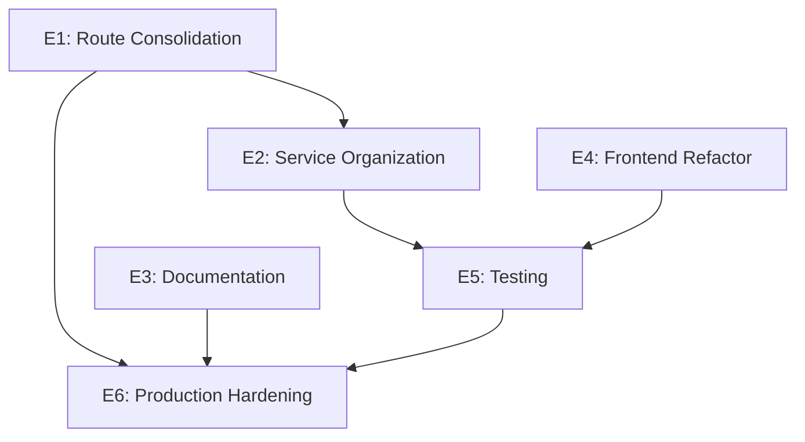

# PRD 01: Overview

**Document**: 01-OVERVIEW.md
**Epic**: N/A (Foundation Document)
**Last Updated**: 2026-01-21

---

## 1. Executive Summary

OpenWatch is an enterprise-grade SCAP compliance scanning platform approaching production readiness. A comprehensive codebase review identified organizational debt from rapid development that must be addressed before production deployment.

This PRD defines the work required to:
1. Eliminate technical debt (duplicate routes, orphaned references)
2. Improve maintainability (service consolidation, documentation)
3. Enable production deployment (guides, monitoring, hardening)
4. Establish sustainable human-AI collaboration patterns

**Estimated Duration**: 12 weeks
**Team**: 1 Human Developer + AI Assistant (Claude)

---

## 2. Problem Statement

### 2.1 Current State

OpenWatch has strong foundations:
- Modern architecture (FastAPI, React 18, TypeScript 5)
- Security-first design (FIPS 140-2, AES-256-GCM)
- Excellent modular services (engine/, content/, ssh/, owca/)

However, rapid development created organizational debt:

| Problem | Impact | Severity |
|---------|--------|----------|
| 3 duplicate route pairs | Runtime conflicts, maintenance burden | Critical |
| 50 flat service files | Navigation difficulty, unclear boundaries | High |
| Deleted services referenced | Potential import errors | Critical |
| 249 unorganized docs | Discovery burden, stale information | Medium |
| 3 oversized components (>2K LOC) | Difficult to maintain and test | Medium |
| Inconsistent state management | Developer confusion, bugs | Medium |
| Missing production guides | Deployment blocker | High |

### 2.2 Why Now?

1. **Production Deployment Approaching**: Cannot deploy with duplicate routes
2. **Team Scaling**: New contributors need clear organization
3. **AI Collaboration**: Claude needs consistent patterns to assist effectively
4. **Technical Debt Compounds**: Longer we wait, harder it gets

---

## 3. Goals and Non-Goals

### 3.1 Goals

| Goal | Measurable Target |
|------|------------------|
| **G1**: Eliminate all duplicate routes | 0 duplicate endpoint pairs |
| **G2**: Organize services into modules | <10 flat service files |
| **G3**: Create production documentation | 5+ deployment/ops guides |
| **G4**: Achieve test coverage | 80% backend, 60% frontend |
| **G5**: Reduce large components | 0 components >1000 LOC |
| **G6**: Document all env variables | 100% coverage in reference doc |
| **G7**: Establish AI collaboration model | Documented in PRD |

### 3.2 Non-Goals (Out of Scope)

| Non-Goal | Rationale |
|----------|-----------|
| API versioning | Future phase after production stable |
| Multi-tenancy | Enterprise feature, not MVP |
| Kubernetes deployment | Docker/Podman sufficient for now |
| Mobile app | Web-first approach |
| Feature additions | Focus on quality, not new features |
| Database migration to different tech | PostgreSQL + MongoDB architecture works |

---

## 4. Success Metrics

### 4.1 Quantitative Metrics

| Metric | Current | Target | Measurement |
|--------|---------|--------|-------------|
| Duplicate routes | 3 pairs | 0 | `grep -r "router.get\|router.post" routes/` |
| Flat service files | 50 | <10 | `ls services/*.py \| wc -l` |
| Test coverage (backend) | Unknown | 80% | `pytest --cov` |
| Test coverage (frontend) | Unknown | 60% | `npm run test:coverage` |
| Documentation files in archive | 0 | 200+ | After reorganization |
| Components >1000 LOC | 3 | 0 | LOC analysis |
| Production guides | 1 | 6 | Count in docs/guides/ |

### 4.2 Qualitative Metrics

| Metric | Current | Target | Assessment |
|--------|---------|--------|------------|
| Time to find a service | Minutes | Seconds | Developer feedback |
| Onboarding time | Unknown | <1 day | New contributor feedback |
| AI task success rate | ~70% | >90% | Track AI task completion |
| Deployment confidence | Low | High | Team confidence survey |

---

## 5. Scope

### 5.1 In Scope

**Backend**
- Route consolidation (eliminate duplicates, complete modular migration)
- Service organization (consolidate flat files into modules)
- Repository pattern expansion
- Test coverage improvement
- Dead code removal

**Frontend**
- Large component extraction
- State management standardization
- API response adapter centralization
- Test coverage improvement

**Documentation**
- Reorganize 249 docs into structured hierarchy
- Create production deployment guide
- Create environment variable reference
- Create monitoring/observability guide
- Archive stale documentation
- Enhance CLAUDE.md with decision trees

**Infrastructure**
- Production docker-compose.prod.yml
- Health check documentation
- Backup/restore procedures
- Security hardening guide

### 5.2 Out of Scope

- New features or functionality
- API versioning implementation
- Database technology changes
- CI/CD pipeline overhaul (existing works)
- Performance optimization (unless blocking)
- UI/UX redesign

---

## 6. Dependencies

### 6.1 Technical Dependencies

| Dependency | Blocks | Reason |
|------------|--------|--------|
| E1 (Routes) | E2, E6 | Must fix runtime conflicts first |
| E2 (Services) | E5 | Need stable services to test |
| E3 (Docs) | E6 | Need guides before production |
| E4 (Frontend) | E5 | Need components extracted for testing |

### 6.2 External Dependencies

| Dependency | Owner | Status | Risk |
|------------|-------|--------|------|
| Docker/Podman runtime | Infrastructure | Available | Low |
| PostgreSQL 15+ | Database team | Available | Low |
| MongoDB 7+ | Database team | Available | Low |
| CI/CD pipeline | DevOps | Working | Low |

---

## 7. Constraints

### 7.1 Technical Constraints

| Constraint | Impact | Mitigation |
|------------|--------|------------|
| No breaking API changes | Must maintain backward compatibility | Deprecation warnings, migration period |
| FIPS compliance required | Cryptographic library restrictions | Use existing approved libraries |
| Python 3.12+ | Some libraries may not support | Verified compatibility |
| TypeScript strict mode | More verbose code | Worth it for type safety |

### 7.2 Resource Constraints

| Constraint | Impact | Mitigation |
|------------|--------|------------|
| 1 human developer | Bottleneck on reviews | AI handles implementation, human reviews |
| AI context limits | Can't hold entire codebase | Modular PRD, context files |
| No dedicated QA | Testing burden on developer | Automated tests, AI-assisted |

### 7.3 Time Constraints

| Constraint | Impact | Mitigation |
|------------|--------|------------|
| 12-week target | Aggressive timeline | Prioritize P0/P1, defer P2 if needed |
| Production deadline | Pressure to cut corners | Focus on critical path only |

---

## 8. Assumptions

| Assumption | If False... |
|------------|-------------|
| Existing tests pass | Must fix tests before refactoring |
| No active production users | Can make breaking changes |
| AI can handle most implementation | Timeline extends significantly |
| Docker deployment is sufficient | Need Kubernetes planning |
| Current database schema is stable | Need migration strategy |

---

## 9. Open Questions

| Question | Owner | Due Date | Status |
|----------|-------|----------|--------|
| What is the production deployment target date? | Human | TBD | Open |
| Are there compliance deadlines (FedRAMP, etc.)? | Human | TBD | Open |
| What monitoring stack will be used? | Human | TBD | Open |
| Is there a staging environment? | Human | TBD | Open |
| What is the backup/DR strategy? | Human | TBD | Open |

---

## 10. References

- [Codebase Review](../docs/CODEBASE_REVIEW_2026_01.md)
- [CLAUDE.md](../CLAUDE.md)
- [Context Files](../context/)
- [Existing Documentation](../docs/)
