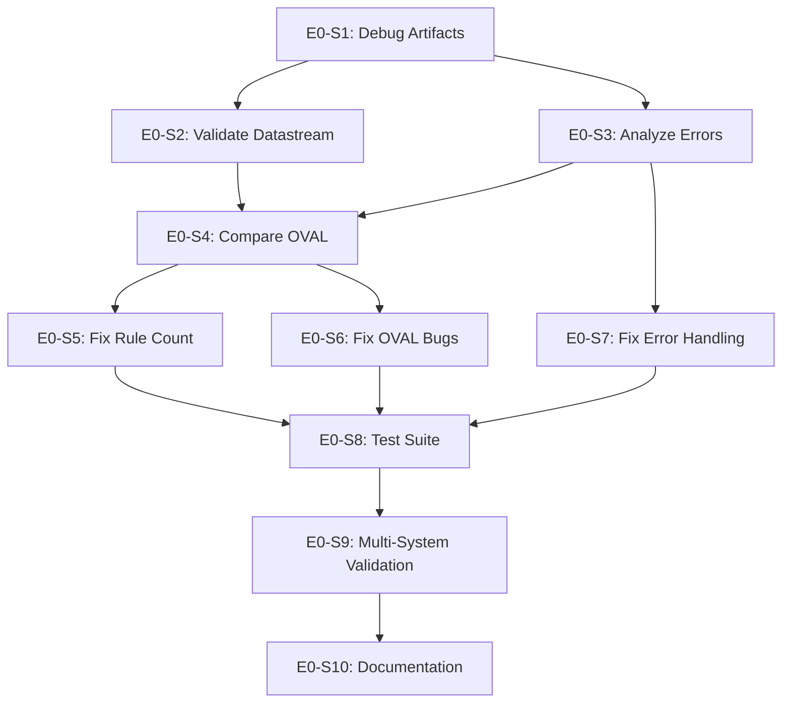

# Epic E0: Scan Result Accuracy

**Epic ID**: E0
**Priority**: P0 (CRITICAL BLOCKER)
**Phase**: 0 (Immediate - Before All Other Work)
**Owner**: Human (lead) with AI support
**Status**: Not Started
**Blocks**: E6 (Production Hardening), Production Deployment

---

## 1. Epic Summary

Resolve the 35% compliance score discrepancy between OpenWatch (61.94%) and native OpenSCAP (97%) when scanning the same RHEL 9 system with the same STIG profile.

**This is the highest priority issue** - OpenWatch cannot be deployed to production if scan results are inaccurate.

---

## 2. Problem Statement

### Current State

| Metric | OpenSCAP | OpenWatch | Delta |
|--------|----------|-----------|-------|
| **Compliance Score** | 97% | 61.94% | **-35%** |
| **Rule Count** | 469 | 402 | -67 (-14%) |
| **Error Rate** | ~0% | 19.15% (77) | **+19%** |
| **Pass Count** | ~455 | 192 | -263 |
| **Fail Count** | ~14 | 118 | +104 |

### Impact

- **Trust**: Users cannot trust OpenWatch scan results
- **Compliance**: False failures create audit burden
- **Adoption**: No organization will use a tool that shows 35% worse results
- **Reputation**: Undermines OpenWatch credibility

### Root Cause Hypotheses (from analysis)

| Hypothesis | Probability | Evidence |
|------------|-------------|----------|
| OVAL transformation errors | 80% | 77 errors (19%), OVAL execution failures |
| Profile selection incomplete | 60% | 67 fewer rules (402 vs 469) |
| Error handling in scoring | 40% | Errors may be counted as failures |
| XCCDF generation errors | 30% | Runtime datastream generation |

---

## 3. Goals

| Goal | Metric | Target |
|------|--------|--------|
| Match rule count | Rules evaluated | 469 (same as SSG) |
| Reduce error rate | Errors / total | < 2% (< 10 errors) |
| Match compliance score | Delta from OpenSCAP | ± 5% |
| OVAL validation | `oscap oval validate` | 100% pass |
| XCCDF validation | `oscap ds sds-validate` | Pass |

---

## 4. Success Criteria

OpenWatch is **production ready** for scanning when:

- [ ] Rule count matches SSG (469 rules for RHEL 9 STIG)
- [ ] Error rate < 2% (fewer than 10 errors)
- [ ] Compliance score within ±5% of native OpenSCAP
- [ ] All OVAL files pass `oscap oval validate`
- [ ] Generated datastream passes `oscap ds sds-validate`
- [ ] Severity distribution roughly matches OpenSCAP
- [ ] Tested on 3+ different RHEL 9 systems with consistent results

---

## 5. User Stories

### Story E0-S1: Capture Debug Artifacts
**Priority**: P0 | **Points**: 2 | **Status**: Not Started

**As a** developer,
**I want** to capture OpenWatch-generated datastreams and raw results,
**So that** I can compare them with native OpenSCAP.

**Acceptance Criteria**:
- [ ] OpenWatch saves generated XCCDF/OVAL datastream before upload
- [ ] OpenWatch saves raw XCCDF results after scan completion
- [ ] Debug files saved to `/var/lib/openwatch/debug/`
- [ ] Logging indicates where files are saved
- [ ] Can be enabled/disabled via config flag

**Implementation**:
```python
# In scan execution service
def execute_scan(target_host: str, profile: str):
    datastream_xml = build_scap_datastream(rules, platform, profile)

    if settings.OPENWATCH_DEBUG_SCAP:
        debug_path = f"/var/lib/openwatch/debug/datastream_{target_host}_{profile}_{timestamp}.xml"
        Path(debug_path).write_text(datastream_xml)
        logger.info(f"Saved datastream to {debug_path}")
```

---

### Story E0-S2: Validate Generated Datastream
**Priority**: P0 | **Points**: 3 | **Status**: Not Started

**As a** developer,
**I want** to validate OpenWatch-generated datastreams,
**So that** I can identify structural issues.

**Acceptance Criteria**:
- [ ] Run `oscap ds sds-validate` on OpenWatch datastream
- [ ] Document all validation errors
- [ ] Compare datastream structure with SSG datastream
- [ ] Identify missing components (OVAL, CPE, etc.)
- [ ] Create fix plan for each validation error

**Commands**:
```bash
# Validate OpenWatch datastream
oscap ds sds-validate /var/lib/openwatch/debug/datastream_*.xml

# Split and compare with SSG
oscap ds sds-split /var/lib/openwatch/debug/datastream_*.xml /tmp/ow_split/
oscap ds sds-split /usr/share/xml/scap/ssg/content/ssg-rhel9-ds.xml /tmp/ssg_split/

# Compare XCCDF benchmark
diff -u /tmp/ssg_split/ssg-rhel9-xccdf.xml /tmp/ow_split/*.xccdf.xml
```

---

### Story E0-S3: Analyze Error Results
**Priority**: P0 | **Points**: 3 | **Status**: Not Started

**As a** developer,
**I want** to understand why 77 rules result in errors,
**So that** I can fix the underlying issues.

**Acceptance Criteria**:
- [ ] Extract all 77 error rule results from XCCDF
- [ ] Categorize errors by type:
  - OVAL execution failures
  - Permission errors
  - Parse errors
  - Missing definitions
- [ ] Identify top 5 error patterns
- [ ] Create fix plan for each error category
- [ ] Document root cause for each error

**Analysis Script**:
```python
import xml.etree.ElementTree as ET

tree = ET.parse('/var/lib/openwatch/debug/results_*.xml')
ns = {'xccdf': 'http://checklists.nist.gov/xccdf/1.2'}

errors = []
for rule_result in tree.findall('.//xccdf:rule-result', ns):
    result = rule_result.find('xccdf:result', ns)
    if result is not None and result.text == 'error':
        rule_id = rule_result.get('idref')
        messages = [m.text for m in rule_result.findall('.//xccdf:message', ns)]
        errors.append({'rule_id': rule_id, 'messages': messages})

# Categorize and report
print(f"Total errors: {len(errors)}")
for error in errors[:10]:
    print(f"  {error['rule_id']}: {error['messages']}")
```

---

### Story E0-S4: Compare OVAL Definitions
**Priority**: P0 | **Points**: 5 | **Status**: Not Started

**As a** developer,
**I want** to compare OpenWatch OVAL with SSG OVAL,
**So that** I can identify transformation errors.

**Acceptance Criteria**:
- [ ] Extract 10 sample OVAL files from OpenWatch bundle
- [ ] Extract corresponding OVAL definitions from SSG
- [ ] Compare structure and logic
- [ ] Validate both with `oscap oval validate`
- [ ] Test both on same system, compare results
- [ ] Document all differences found
- [ ] Identify transformation bugs

**Sample Rules to Compare**:
1. `audit_rules_dac_modification_chmod`
2. `accounts_password_pam_minlen`
3. `sshd_disable_root_login`
4. `selinux_state`
5. `ensure_gpgcheck_globally_activated`

---

### Story E0-S5: Fix Rule Count Mismatch
**Priority**: P0 | **Points**: 4 | **Status**: Not Started

**As a** developer,
**I want** OpenWatch to evaluate all 469 STIG rules,
**So that** coverage matches native OpenSCAP.

**Acceptance Criteria**:
- [ ] Identify all 67 missing rules
- [ ] Determine why rules are missing:
  - Not in bundle?
  - Not mapped to STIG?
  - Filtered by platform?
  - Profile selection issue?
- [ ] Fix bundle or profile to include missing rules
- [ ] Verify 469 rules evaluated after fix

**Investigation**:
```bash
# Count STIG rules in bundle
python3 -c "
import bson
from pathlib import Path

stig_rhel9 = 0
for f in Path('bundle/rules').glob('*.bson'):
    rule = bson.decode(f.read_bytes())
    frameworks = rule.get('frameworks', {})
    platforms = rule.get('platform_implementations', {})
    if ('disa_stig' in frameworks or 'stigid' in frameworks) and 'rhel9' in platforms:
        stig_rhel9 += 1

print(f'RHEL 9 STIG rules in bundle: {stig_rhel9}')
"

# Compare with SSG
oscap info /usr/share/xml/scap/ssg/content/ssg-rhel9-ds.xml | grep -A5 "Profile.*stig"
```

---

### Story E0-S6: Fix OVAL Transformation Bugs
**Priority**: P0 | **Points**: 8 | **Status**: Not Started

**As a** developer,
**I want** OVAL transformations to produce valid, accurate checks,
**So that** scan results match native OpenSCAP.

**Acceptance Criteria**:
- [ ] Review TRANSFORMATION_GAPS_ANALYSIS.md for known issues
- [ ] Fix all 12 critical transformation gaps
- [ ] All OVAL files pass `oscap oval validate`
- [ ] OVAL results match SSG OVAL results on test system
- [ ] Error rate reduced to < 2%

**Known Issues to Address**:
1. OVAL definition ID format
2. OVAL test logic transformation
3. OVAL object path mappings
4. OVAL state expected values
5. Platform version checks

---

### Story E0-S7: Fix Error Handling in Result Parser
**Priority**: P1 | **Points**: 3 | **Status**: Not Started

**As a** developer,
**I want** errors handled correctly in compliance scoring,
**So that** scores are calculated accurately.

**Acceptance Criteria**:
- [ ] Audit result parsing code
- [ ] Verify errors are NOT counted as failures
- [ ] Verify compliance score formula:
  - `score = passed / (passed + failed)` (errors excluded)
- [ ] Add unit tests for result parsing
- [ ] Document scoring methodology

**Code Review Checklist**:
```python
# Check these in result parser:
# 1. How is 'error' result handled?
# 2. How is 'notapplicable' handled?
# 3. How is 'notchecked' handled?
# 4. What's the compliance score formula?
# 5. Are severities from XCCDF or overridden?
```

---

### Story E0-S8: Create Comparison Test Suite
**Priority**: P1 | **Points**: 4 | **Status**: Not Started

**As a** developer,
**I want** automated tests comparing OpenWatch vs OpenSCAP,
**So that** accuracy is continuously verified.

**Acceptance Criteria**:
- [ ] Test script runs both scans on same system
- [ ] Compares rule-by-rule results
- [ ] Reports discrepancies
- [ ] Fails if delta > 5%
- [ ] Can run in CI/CD pipeline
- [ ] Tests multiple profiles (STIG, CIS, PCI-DSS)

**Test Script**:
```bash
#!/bin/bash
# tests/integration/test_scan_accuracy.sh

SYSTEM=$1
PROFILE=$2
MAX_DELTA=5

# Run native OpenSCAP
oscap xccdf eval --profile $PROFILE --results /tmp/native.xml \
  /usr/share/xml/scap/ssg/content/ssg-rhel9-ds.xml

# Run OpenWatch scan
openwatch scan --host $SYSTEM --profile $PROFILE --output /tmp/openwatch.xml

# Compare results
python3 compare_results.py /tmp/native.xml /tmp/openwatch.xml --max-delta $MAX_DELTA
```

---

### Story E0-S9: Validate on Multiple Systems
**Priority**: P1 | **Points**: 3 | **Status**: Not Started

**As a** quality engineer,
**I want** scan accuracy validated on multiple systems,
**So that** I know fixes work broadly.

**Acceptance Criteria**:
- [ ] Test on 3+ different RHEL 9 systems
- [ ] Test systems with different compliance levels
- [ ] All systems show < 5% delta from OpenSCAP
- [ ] Document results for each system
- [ ] No regressions on previously working systems

**Test Matrix**:
| System | Compliance Level | OpenSCAP | OpenWatch | Delta |
|--------|------------------|----------|-----------|-------|
| owas-tst01 | High (~95%) | TBD | TBD | TBD |
| owas-tst02 | Medium (~80%) | 97% | TBD | TBD |
| owas-tst03 | Low (~60%) | TBD | TBD | TBD |

---

### Story E0-S10: Document Scanning Accuracy
**Priority**: P2 | **Points**: 2 | **Status**: Not Started

**As a** user,
**I want** documentation on OpenWatch scanning accuracy,
**So that** I understand any limitations.

**Acceptance Criteria**:
- [ ] `docs/guides/SCANNING_ACCURACY.md` created
- [ ] Documents expected accuracy (±5% of OpenSCAP)
- [ ] Lists known limitations
- [ ] Explains differences from native OpenSCAP
- [ ] Troubleshooting for discrepancies

---

## 6. Dependencies



**Execution Order**:
1. S1 (Debug artifacts) - Enables all investigation
2. S2, S3 (Validation, error analysis - parallel)
3. S4 (OVAL comparison)
4. S5, S6, S7 (Fixes - can be parallel)
5. S8 (Test suite)
6. S9 (Multi-system validation)
7. S10 (Documentation)

---

## 7. Risks and Mitigations

| Risk | Impact | Likelihood | Mitigation |
|------|--------|------------|------------|
| OVAL transformation requires major rewrite | High | Medium | Scope fix to critical rules first |
| Bundle regeneration breaks other platforms | High | Low | Test all platforms after changes |
| Root cause is in upstream ComplianceAsCode | High | Low | Document workaround, report upstream |
| Fix takes longer than 2 weeks | Medium | Medium | Prioritize most impactful fixes |

---

## 8. Acceptance Criteria (Epic Level)

- [ ] Compliance score within ±5% of native OpenSCAP
- [ ] Rule count matches (469 for RHEL 9 STIG)
- [ ] Error rate < 2%
- [ ] All OVAL files validate
- [ ] Generated datastream validates
- [ ] Tested on 3+ systems
- [ ] Automated comparison tests pass
- [ ] Documentation complete

---

## 9. Definition of Done

- [ ] All stories completed
- [ ] Scan accuracy verified on multiple systems
- [ ] Automated tests in CI/CD
- [ ] Documentation updated
- [ ] No regressions on other platforms
- [ ] Stakeholder sign-off on accuracy

---

## 10. Timeline

**This epic MUST be completed before production deployment.**

| Week | Focus | Milestone |
|------|-------|-----------|
| 1 | Investigation (S1-S4) | Root cause identified |
| 2 | Fixes (S5-S7) | Core issues fixed |
| 3 | Validation (S8-S9) | Accuracy verified |
| 4 | Buffer + Documentation | Production ready |

**Total**: 4 weeks (runs parallel to or before E1)

---

## 11. Reference Documents

- [SCAN_DISCREPANCY_ANALYSIS.md](../../docs/SCAN_DISCREPANCY_ANALYSIS.md) - Original analysis
- [TRANSFORMATION_GAPS_ANALYSIS.md](../../docs/TRANSFORMATION_GAPS_ANALYSIS.md) - Known OVAL issues
- SCAP Security Guide (SSG) - Reference implementation
- OpenSCAP documentation - Validation commands

---

## 12. Investigation Commands Reference

```bash
# Validate OpenWatch datastream
oscap ds sds-validate /path/to/openwatch_datastream.xml

# Validate individual OVAL file
oscap oval validate /path/to/oval.xml

# Test OVAL on system
oscap oval eval --results /tmp/results.xml /path/to/oval.xml

# Compare XCCDF results
python3 compare_results.py native.xml openwatch.xml

# Count rules in profile
xmllint --xpath "count(//xccdf:select[@selected='true'])" datastream.xml
```
