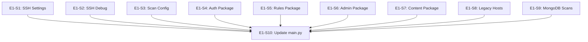

# Epic E1: Route Consolidation

**Epic ID**: E1
**Priority**: P0 (Critical)
**Phase**: 1 (Week 1-2)
**Owner**: AI (Claude) with Human review
**Status**: Not Started

---

## 1. Epic Summary

Eliminate duplicate route files and complete the migration to modular route packages. This is a critical blocker for production deployment.

---

## 2. Problem Statement

The routes directory contains:
- **3 duplicate route pairs** with conflicting implementations
- **50+ flat route files** alongside modular packages
- **Legacy files** that should be deprecated

This creates:
- Runtime conflicts (which endpoint responds?)
- Maintenance burden (updating two places)
- Developer confusion (which file to modify?)

---

## 3. Goals

| Goal | Metric | Target |
|------|--------|--------|
| Eliminate duplicate routes | Count of duplicate pairs | 0 |
| Complete modular migration | Flat files remaining | <10 |
| Remove legacy files | Legacy file count | 0 |
| Maintain API compatibility | Breaking changes | 0 |

---

## 4. Current State

### 4.1 Duplicate Route Pairs (CRITICAL)

| Old Location | New Location | Endpoints |
|--------------|--------------|-----------|
| `routes/ssh_settings.py` | `routes/ssh/settings.py` | `/policy`, `/known-hosts`, `/test-connectivity` |
| `routes/ssh_debug.py` | `routes/ssh/debug.py` | `/debug/*` |
| `routes/scan_config_api.py` | `routes/scans/config.py` | `/frameworks`, `/templates`, `/statistics` |

### 4.2 Modular Packages (Completed)

- `routes/hosts/` - crud, discovery, helpers, models
- `routes/scans/` - crud, config, compliance, rules, templates, etc.
- `routes/compliance/` - drift, intelligence, owca
- `routes/ssh/` - settings, debug
- `routes/integrations/` - plugins, webhooks
- `routes/host_groups/` - crud, scans, models

### 4.3 Flat Files (Need Migration)

| File | Target Package | Priority |
|------|----------------|----------|
| `auth.py` | `routes/auth/` | High |
| `authorization.py` | `routes/auth/` | High |
| `mfa.py` | `routes/auth/` | High |
| `api_keys.py` | `routes/auth/` | High |
| `users.py` | `routes/admin/` | Medium |
| `audit.py` | `routes/admin/` | Medium |
| `credentials.py` | `routes/admin/` | Medium |
| `rule_management.py` | `routes/rules/` | High |
| `rule_scanning.py` | `routes/rules/` | High |
| `compliance_rules_api.py` | `routes/rules/` | High |
| `content.py` | `routes/content/` | Medium |
| `scap_import.py` | `routes/content/` | Medium |
| `xccdf_api.py` | `routes/content/` | Medium |
| `hosts_legacy.py` | DELETE | Critical |
| `mongodb_scan_api.py` | `routes/scans/` | Medium |

---

## 5. User Stories

### Story E1-S1: Eliminate SSH Settings Duplicate
**Priority**: P0 | **Points**: 3 | **Status**: Not Started

**As a** developer,
**I want** a single source of truth for SSH settings endpoints,
**So that** I don't have conflicting implementations.

**Acceptance Criteria**:
- [ ] `routes/ssh/settings.py` contains all SSH settings functionality
- [ ] `routes/ssh_settings.py` is deleted
- [ ] All imports updated (grep finds no references to old file)
- [ ] All tests pass
- [ ] API behavior unchanged (verified with curl)

**Implementation Notes**:
1. Compare both files for differences
2. Merge any unique functionality into `routes/ssh/settings.py`
3. Update all imports in `main.py` and anywhere else
4. Delete `routes/ssh_settings.py`
5. Run full test suite

---

### Story E1-S2: Eliminate SSH Debug Duplicate
**Priority**: P0 | **Points**: 2 | **Status**: Not Started

**As a** developer,
**I want** a single source of truth for SSH debug endpoints,
**So that** debugging tools work consistently.

**Acceptance Criteria**:
- [ ] `routes/ssh/debug.py` contains all SSH debug functionality
- [ ] `routes/ssh_debug.py` is deleted
- [ ] All imports updated
- [ ] All tests pass
- [ ] API behavior unchanged

---

### Story E1-S3: Eliminate Scan Config Duplicate
**Priority**: P0 | **Points**: 3 | **Status**: Not Started

**As a** developer,
**I want** a single source of truth for scan configuration endpoints,
**So that** scan configuration is consistent.

**Acceptance Criteria**:
- [ ] `routes/scans/config.py` contains all scan config functionality
- [ ] `routes/scan_config_api.py` is deleted
- [ ] All imports updated
- [ ] All tests pass
- [ ] API behavior unchanged

---

### Story E1-S4: Create Auth Route Package
**Priority**: P1 | **Points**: 5 | **Status**: Not Started

**As a** developer,
**I want** authentication routes organized in a package,
**So that** auth-related code is easy to find and maintain.

**Acceptance Criteria**:
- [ ] `routes/auth/` directory created with `__init__.py`
- [ ] `routes/auth/login.py` - Login/logout endpoints
- [ ] `routes/auth/mfa.py` - MFA endpoints (from `mfa.py`)
- [ ] `routes/auth/api_keys.py` - API key endpoints (from `api_keys.py`)
- [ ] `routes/auth/sessions.py` - Session management
- [ ] Old flat files deleted
- [ ] All imports updated
- [ ] All tests pass

**Package Structure**:
```
routes/auth/
├── __init__.py      # Router aggregation
├── login.py         # /auth/login, /auth/logout, /auth/refresh
├── mfa.py           # /auth/mfa/*
├── api_keys.py      # /auth/api-keys/*
└── sessions.py      # /auth/sessions/*
```

---

### Story E1-S5: Create Rules Route Package
**Priority**: P1 | **Points**: 5 | **Status**: Not Started

**As a** developer,
**I want** rule-related routes organized in a package,
**So that** rule management code is cohesive.

**Acceptance Criteria**:
- [ ] `routes/rules/` directory created
- [ ] `routes/rules/crud.py` - Basic rule CRUD
- [ ] `routes/rules/management.py` - From `rule_management.py`
- [ ] `routes/rules/scanning.py` - From `rule_scanning.py`
- [ ] `routes/rules/compliance.py` - From `compliance_rules_api.py`
- [ ] Old flat files deleted
- [ ] All imports updated
- [ ] All tests pass

---

### Story E1-S6: Create Admin Route Package
**Priority**: P2 | **Points**: 3 | **Status**: Not Started

**As a** developer,
**I want** admin routes organized in a package,
**So that** administrative functions are grouped.

**Acceptance Criteria**:
- [ ] `routes/admin/` directory created
- [ ] `routes/admin/users.py` - From `users.py`
- [ ] `routes/admin/audit.py` - From `audit.py`
- [ ] `routes/admin/settings.py` - System settings
- [ ] Old flat files deleted
- [ ] All imports updated
- [ ] All tests pass

---

### Story E1-S7: Create Content Route Package
**Priority**: P2 | **Points**: 4 | **Status**: Not Started

**As a** developer,
**I want** SCAP content routes organized in a package,
**So that** content management is cohesive.

**Acceptance Criteria**:
- [ ] `routes/content/` directory created
- [ ] `routes/content/scap.py` - From `content.py`
- [ ] `routes/content/import_.py` - From `scap_import.py`
- [ ] `routes/content/xccdf.py` - From `xccdf_api.py`
- [ ] Old flat files deleted
- [ ] All imports updated
- [ ] All tests pass

---

### Story E1-S8: Remove Legacy Host Routes
**Priority**: P0 | **Points**: 2 | **Status**: Not Started

**As a** developer,
**I want** legacy host routes removed,
**So that** there's no confusion about which endpoints to use.

**Acceptance Criteria**:
- [ ] Verified `routes/hosts/` has all necessary functionality
- [ ] `routes/hosts_legacy.py` deleted
- [ ] No other legacy host files remain
- [ ] All imports updated
- [ ] All tests pass
- [ ] Frontend verified to work correctly

---

### Story E1-S9: Consolidate MongoDB Scan Routes
**Priority**: P2 | **Points**: 3 | **Status**: Not Started

**As a** developer,
**I want** MongoDB scan routes in the scans package,
**So that** all scan routes are in one place.

**Acceptance Criteria**:
- [ ] Functionality from `mongodb_scan_api.py` merged into `routes/scans/`
- [ ] `mongodb_scan_api.py` deleted
- [ ] All imports updated
- [ ] All tests pass

---

### Story E1-S10: Update main.py Router Registration
**Priority**: P0 | **Points**: 2 | **Status**: Not Started

**As a** developer,
**I want** main.py to only register modular route packages,
**So that** the router configuration is clean and consistent.

**Acceptance Criteria**:
- [ ] main.py includes only package routers (not individual files)
- [ ] All routes accessible via `/api` prefix
- [ ] OpenAPI docs reflect correct structure
- [ ] All tests pass

---

## 6. Dependencies



**Execution Order**:
1. S1, S2, S3 (Duplicates - can be parallel)
2. S8 (Legacy removal)
3. S4, S5 (High priority packages - can be parallel)
4. S6, S7, S9 (Medium priority - can be parallel)
5. S10 (Final cleanup)

---

## 7. Risks and Mitigations

| Risk | Impact | Likelihood | Mitigation |
|------|--------|------------|------------|
| Breaking API compatibility | High | Medium | Compare endpoints before/after |
| Missing functionality in merge | High | Medium | Thorough diff of duplicate files |
| Frontend breaks | High | Low | Test frontend after each change |
| Test failures | Medium | Medium | Run tests after each story |

---

## 8. Acceptance Criteria (Epic Level)

- [ ] Zero duplicate route files
- [ ] All routes in modular packages (except truly standalone utilities)
- [ ] `main.py` router registration is clean
- [ ] All tests pass
- [ ] Frontend fully functional
- [ ] OpenAPI docs accurate
- [ ] No deprecation warnings in logs

---

## 9. Definition of Done

- [ ] All stories completed
- [ ] Code reviewed and approved
- [ ] Tests pass (unit + integration)
- [ ] Documentation updated
- [ ] No regressions introduced
- [ ] Committed with proper messages

---

## 10. Notes

### Files to Delete After This Epic
```
routes/ssh_settings.py
routes/ssh_debug.py
routes/scan_config_api.py
routes/hosts_legacy.py
routes/mongodb_scan_api.py
routes/auth.py (after migration)
routes/mfa.py (after migration)
routes/api_keys.py (after migration)
routes/users.py (after migration)
routes/audit.py (after migration)
routes/rule_management.py (after migration)
routes/rule_scanning.py (after migration)
routes/compliance_rules_api.py (after migration)
routes/content.py (after migration)
routes/scap_import.py (after migration)
routes/xccdf_api.py (after migration)
```

### New Packages Created
```
routes/auth/
routes/rules/
routes/admin/
routes/content/
```
