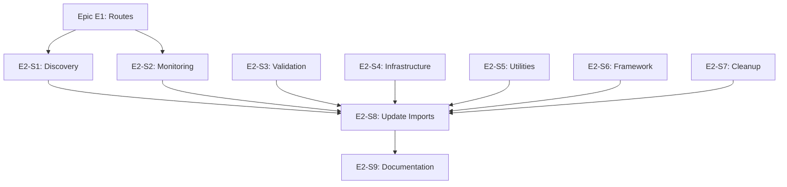

# Epic E2: Service Organization

**Epic ID**: E2
**Priority**: P1 (High)
**Phase**: 2 (Week 3-4)
**Owner**: AI (Claude) with Human review
**Status**: Not Started
**Depends On**: E1 (Route Consolidation)

---

## 1. Epic Summary

Consolidate 50 flat service files into organized subdirectories following the exemplary patterns established in `engine/`, `content/`, and `ssh/` modules.

---

## 2. Problem Statement

The `services/` directory contains:
- **50 flat .py files** at the root level
- **Excellent modular subdirectories** (engine/, content/, ssh/, owca/)
- **Inconsistent organization** between old and new code

This creates:
- Difficulty navigating the codebase
- Unclear module boundaries
- Harder onboarding for new contributors
- AI confusion about which service to use

---

## 3. Goals

| Goal | Metric | Target |
|------|--------|--------|
| Reduce flat files | Count at services/ root | <10 |
| Create logical modules | New subdirectories | 5+ |
| Clear boundaries | Services with single responsibility | 100% |
| Consistent patterns | Modules with __init__.py exports | 100% |

---

## 4. Current State

### 4.1 Exemplary Modules (Keep As-Is)

| Module | Files | Purpose |
|--------|-------|---------|
| `engine/` | 20+ | Scan execution, orchestration |
| `content/` | 10+ | SCAP content processing |
| `ssh/` | 10+ | SSH connection management |
| `owca/` | 15+ | Compliance analysis |
| `auth/` | 5+ | Credential management |
| `authorization/` | 5+ | Access control |
| `compliance_rules/` | 10+ | Rule uploads, validation |
| `plugins/` | 30+ | Plugin system |
| `rules/` | 5+ | Rule service, cache |
| `remediation/` | 5+ | Remediation recommendations |
| `host_validator/` | 3+ | Host readiness |
| `framework/` | 5+ | Framework mapping |
| `xccdf/` | 3+ | XCCDF generation |

### 4.2 Flat Files (Need Organization)

**Discovery Services** (→ `services/discovery/`):
- `host_discovery_service.py`
- `host_compliance_discovery.py`
- `host_network_discovery.py`
- `host_security_discovery.py`

**Monitoring Services** (→ `services/monitoring/`):
- `health_monitoring_service.py`
- `host_monitor.py`
- `host_monitoring_state.py`
- `drift_detection_service.py`
- `integration_metrics.py`
- `adaptive_scheduler_service.py`

**Validation Services** (→ `services/validation/`):
- `unified_validation_service.py`
- `group_validation_service.py`
- `error_classification.py`
- `error_sanitization.py`
- `system_info_sanitization.py`

**Infrastructure Services** (→ `services/infrastructure/`):
- `terminal_service.py`
- `command_sandbox.py`
- `http_client.py`
- `email_service.py`
- `webhook_security.py`

**Utility Services** (→ `services/utilities/`):
- `session_migration_service.py`
- `key_lifecycle_manager.py`
- `migration_runner.py`
- `secure_automated_fixes.py`

**Scan Services** (→ integrate with `engine/`):
- `scan_intelligence.py`

---

## 5. User Stories

### Story E2-S1: Create Discovery Module
**Priority**: P1 | **Points**: 5 | **Status**: Not Started

**As a** developer,
**I want** host discovery services in a dedicated module,
**So that** discovery-related code is easy to find.

**Acceptance Criteria**:
- [ ] `services/discovery/` directory created with `__init__.py`
- [ ] `services/discovery/host.py` - General host discovery
- [ ] `services/discovery/compliance.py` - Compliance discovery
- [ ] `services/discovery/network.py` - Network discovery
- [ ] `services/discovery/security.py` - Security discovery
- [ ] All imports updated throughout codebase
- [ ] Old flat files deleted
- [ ] All tests pass

**Package Structure**:
```
services/discovery/
├── __init__.py           # Exports: HostDiscoveryService, ComplianceDiscovery, etc.
├── host.py               # General host discovery
├── compliance.py         # Compliance-based discovery
├── network.py            # Network scanning/discovery
└── security.py           # Security posture discovery
```

**Implementation Notes**:
- Follow pattern from `services/ssh/` module
- Use `__init__.py` to re-export public classes
- Maintain backward compatibility with deprecation warnings

---

### Story E2-S2: Create Monitoring Module
**Priority**: P1 | **Points**: 5 | **Status**: Not Started

**As a** developer,
**I want** monitoring services in a dedicated module,
**So that** health and monitoring code is cohesive.

**Acceptance Criteria**:
- [ ] `services/monitoring/` directory created with `__init__.py`
- [ ] `services/monitoring/health.py` - Health monitoring
- [ ] `services/monitoring/host.py` - Host monitoring
- [ ] `services/monitoring/drift.py` - Drift detection
- [ ] `services/monitoring/metrics.py` - Integration metrics
- [ ] `services/monitoring/scheduler.py` - Adaptive scheduling
- [ ] All imports updated
- [ ] Old flat files deleted
- [ ] All tests pass

**Package Structure**:
```
services/monitoring/
├── __init__.py           # Exports all monitoring services
├── health.py             # System health monitoring
├── host.py               # Host status monitoring
├── state.py              # Monitoring state management
├── drift.py              # Configuration drift detection
├── metrics.py            # Integration metrics collection
└── scheduler.py          # Adaptive scan scheduling
```

---

### Story E2-S3: Create Validation Module
**Priority**: P1 | **Points**: 4 | **Status**: Not Started

**As a** developer,
**I want** validation services in a dedicated module,
**So that** validation logic is centralized.

**Acceptance Criteria**:
- [ ] `services/validation/` directory created with `__init__.py`
- [ ] `services/validation/unified.py` - Unified validation
- [ ] `services/validation/group.py` - Group validation
- [ ] `services/validation/errors.py` - Error classification
- [ ] `services/validation/sanitization.py` - Input sanitization
- [ ] All imports updated
- [ ] Old flat files deleted
- [ ] All tests pass

**Package Structure**:
```
services/validation/
├── __init__.py           # Exports validation services
├── unified.py            # Unified validation service
├── group.py              # Group validation
├── errors.py             # Error classification & handling
└── sanitization.py       # Input/output sanitization
```

---

### Story E2-S4: Create Infrastructure Module
**Priority**: P2 | **Points**: 4 | **Status**: Not Started

**As a** developer,
**I want** infrastructure services in a dedicated module,
**So that** infrastructure code is separate from business logic.

**Acceptance Criteria**:
- [ ] `services/infrastructure/` directory created with `__init__.py`
- [ ] `services/infrastructure/terminal.py` - Terminal service
- [ ] `services/infrastructure/sandbox.py` - Command sandbox
- [ ] `services/infrastructure/http.py` - HTTP client
- [ ] `services/infrastructure/email.py` - Email service
- [ ] `services/infrastructure/webhooks.py` - Webhook security
- [ ] All imports updated
- [ ] Old flat files deleted
- [ ] All tests pass

---

### Story E2-S5: Create Utilities Module
**Priority**: P2 | **Points**: 3 | **Status**: Not Started

**As a** developer,
**I want** utility services in a dedicated module,
**So that** cross-cutting utilities are organized.

**Acceptance Criteria**:
- [ ] `services/utilities/` directory created with `__init__.py`
- [ ] `services/utilities/session_migration.py`
- [ ] `services/utilities/key_lifecycle.py`
- [ ] `services/utilities/migration.py`
- [ ] All imports updated
- [ ] Old flat files deleted
- [ ] All tests pass

---

### Story E2-S6: Consolidate Framework Services
**Priority**: P1 | **Points**: 3 | **Status**: Not Started

**As a** developer,
**I want** framework services properly consolidated,
**So that** there's no confusion between modules.

**Acceptance Criteria**:
- [ ] `compliance_framework_mapper.py` merged into `services/framework/`
- [ ] Clear relationship documented between `framework/` and `owca/framework/`
- [ ] All imports updated
- [ ] No circular dependencies
- [ ] All tests pass

**Investigation Required**:
1. What's the difference between `compliance_framework_mapper.py` and `framework/mapper.py`?
2. How does `owca/framework/` relate to `framework/`?
3. Are there circular imports?

---

### Story E2-S7: Clean Up Remaining Flat Files
**Priority**: P2 | **Points**: 3 | **Status**: Not Started

**As a** developer,
**I want** all remaining flat files either organized or justified,
**So that** the services root is clean.

**Acceptance Criteria**:
- [ ] Each remaining flat file is either:
  - Moved to appropriate module
  - Documented as intentionally standalone
- [ ] Less than 10 flat files remain at services root
- [ ] All tests pass

**Files to Evaluate**:
- `scan_intelligence.py` → Consider moving to `engine/`
- `secure_automated_fixes.py` → Consider moving to `remediation/`
- Any other remaining files

---

### Story E2-S8: Update Service Imports in Routes
**Priority**: P1 | **Points**: 3 | **Status**: Not Started

**As a** developer,
**I want** all routes to use consistent service imports,
**So that** the codebase follows the same patterns.

**Acceptance Criteria**:
- [ ] All routes import from `__init__.py` not internal files
- [ ] No direct imports from moved files
- [ ] Deprecation warnings for old import paths
- [ ] All tests pass

**Example**:
```python
# GOOD
from backend.app.services.discovery import HostDiscoveryService

# BAD (should trigger deprecation warning)
from backend.app.services.host_discovery_service import HostDiscoveryService
```

---

### Story E2-S9: Document Service Module Boundaries
**Priority**: P1 | **Points**: 2 | **Status**: Not Started

**As a** developer,
**I want** clear documentation of what each module owns,
**So that** I know where to add new code.

**Acceptance Criteria**:
- [ ] `context/MODULE_BOUNDARIES.md` created
- [ ] Each module has documented:
  - Purpose
  - What it owns
  - What it depends on
  - What it does NOT do
- [ ] Document added to CLAUDE.md context file table

**Content Template**:
```markdown
## discovery/
**Purpose**: Host and network discovery
**Owns**:
- Host scanning
- Network enumeration
- Compliance discovery
**Depends on**: ssh/, infrastructure/
**Does NOT**: Execute scans (that's engine/)
```

---

## 6. Dependencies



**Execution Order**:
1. S1, S2, S3 (Core modules - can be parallel)
2. S4, S5 (Support modules - can be parallel)
3. S6 (Framework consolidation)
4. S7 (Remaining cleanup)
5. S8 (Import updates)
6. S9 (Documentation)

---

## 7. Risks and Mitigations

| Risk | Impact | Likelihood | Mitigation |
|------|--------|------------|------------|
| Circular imports | High | Medium | Map dependencies before moving |
| Breaking existing imports | High | High | Deprecation warnings, not instant removal |
| Missing service in merge | Medium | Medium | Comprehensive file audit |
| Test failures | Medium | Medium | Run tests after each story |

---

## 8. Acceptance Criteria (Epic Level)

- [ ] Less than 10 flat files at services root
- [ ] 5 new modules created (discovery, monitoring, validation, infrastructure, utilities)
- [ ] All modules have `__init__.py` with proper exports
- [ ] No circular dependencies
- [ ] All tests pass
- [ ] Module boundaries documented

---

## 9. Definition of Done

- [ ] All stories completed
- [ ] Code reviewed and approved
- [ ] Tests pass (unit + integration)
- [ ] `context/MODULE_BOUNDARIES.md` created
- [ ] No regressions introduced
- [ ] Committed with proper messages

---

## 10. Module Patterns

### 10.1 Standard `__init__.py` Pattern

```python
"""
Discovery services module.

This module provides host and network discovery functionality.

Usage:
    from backend.app.services.discovery import (
        HostDiscoveryService,
        NetworkDiscoveryService,
        ComplianceDiscoveryService,
    )

    discovery = HostDiscoveryService()
    hosts = await discovery.discover_hosts(network="192.168.1.0/24")
"""

from .host import HostDiscoveryService
from .network import NetworkDiscoveryService
from .compliance import ComplianceDiscoveryService
from .security import SecurityDiscoveryService

__all__ = [
    "HostDiscoveryService",
    "NetworkDiscoveryService",
    "ComplianceDiscoveryService",
    "SecurityDiscoveryService",
]

__version__ = "1.0.0"
```

### 10.2 Backward Compatibility Pattern

```python
# In old location (e.g., services/host_discovery_service.py)
"""
DEPRECATED: This module has moved to services/discovery/host.py

This file provides backward compatibility and will be removed in v2.0.0.
"""
import warnings
from .discovery.host import HostDiscoveryService

warnings.warn(
    "Importing from host_discovery_service is deprecated. "
    "Use 'from backend.app.services.discovery import HostDiscoveryService' instead.",
    DeprecationWarning,
    stacklevel=2
)

__all__ = ["HostDiscoveryService"]
```
