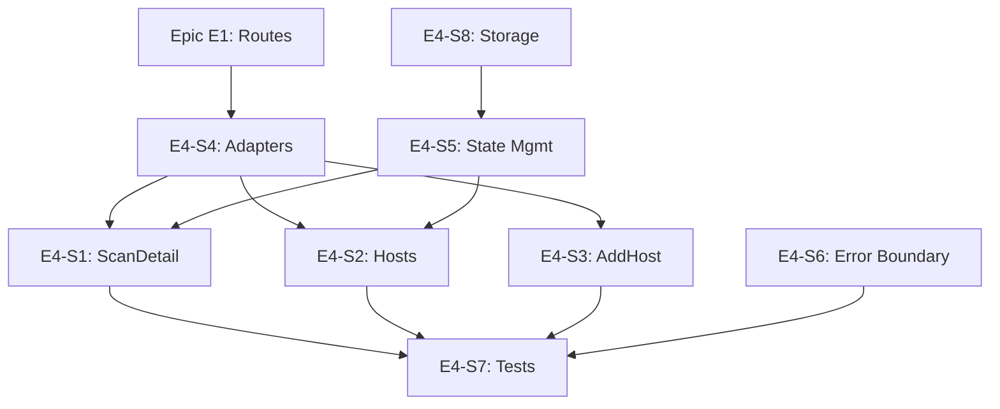

# Epic E4: Frontend Refactoring

**Epic ID**: E4
**Priority**: P2 (Medium)
**Phase**: 3-4 (Week 5-8)
**Owner**: AI (Claude) with Human review
**Status**: Complete (2026-01-30)
**Depends On**: E1 (Route changes may affect API calls)

---

## 1. Epic Summary

Extract oversized components, standardize state management patterns, and centralize API response handling to improve frontend maintainability.

---

## 2. Problem Statement

The frontend has:
- **3 components exceeding 2,000 lines** (ScanDetail, Hosts, AddHost)
- **Inconsistent state management** (Redux thunks vs services vs React Query)
- **Scattered API response mapping** (snake_case → camelCase in multiple files)
- **No global error boundary integration**

This creates:
- Difficult testing of large components
- Developer confusion about which pattern to use
- Duplicated transformation logic
- Poor error handling UX

---

## 3. Goals

| Goal | Metric | Target |
|------|--------|--------|
| Reduce component size | Components >1000 LOC | 0 |
| Standardize state | State patterns | 2 (Redux UI, RQ server) |
| Centralize API handling | Response adapters | 1 per domain |
| Improve error handling | Global error boundary | Yes |

---

## 4. Current State Analysis

### 4.1 Oversized Components

| Component | Lines | Issue |
|-----------|-------|-------|
| `ScanDetail.tsx` | 2,289 | Progress, results, actions all in one |
| `Hosts.tsx` | 2,014 | Table, grid, import, filters all in one |
| `AddHost.tsx` | 1,866 | Multi-step form in single file |

### 4.2 State Management Patterns

| Pattern | Usage | Files |
|---------|-------|-------|
| Redux async thunks | Host operations | `hostSlice.ts` |
| Direct fetch services | Scan operations | `scanService.ts` |
| React Query | Frameworks | `useFrameworks.ts` |

### 4.3 API Response Handling

Snake_case to camelCase transformation exists in:
- `Dashboard.tsx`
- `Hosts.tsx`
- `useHostData.ts`
- Various other components

---

## 5. User Stories

### Story E4-S1: Extract ScanDetail Components
**Priority**: P1 | **Points**: 5 | **Status**: Complete

**As a** developer,
**I want** ScanDetail broken into smaller components,
**So that** each part is testable and maintainable.

**Acceptance Criteria**:
- [x] `pages/scans/ScanDetail/` directory created
- [x] `index.tsx` - Orchestration only (~200 LOC)
- [x] `ScanProgress.tsx` - Progress tracking UI
- [x] `ResultsOverview.tsx` - Summary statistics
- [x] `RuleResults.tsx` - Rule-by-rule results
- [x] `HostResults.tsx` - Per-host breakdown
- [x] `ScanActions.tsx` - Retry, export, cancel
- [x] `hooks/useScanPolling.ts` - Polling logic
- [x] `hooks/useScanResults.ts` - Results fetching
- [x] Original functionality preserved
- [x] All tests pass

**Target Structure**:
```
pages/scans/ScanDetail/
├── index.tsx              # Main orchestration
├── ScanProgress.tsx       # Progress bar, status
├── ResultsOverview.tsx    # Stats cards
├── RuleResults.tsx        # Rules table
├── HostResults.tsx        # Hosts breakdown
├── ScanActions.tsx        # Action buttons
├── types.ts               # Local types
└── hooks/
    ├── useScanPolling.ts
    └── useScanResults.ts
```

---

### Story E4-S2: Extract Hosts Page Components
**Priority**: P1 | **Points**: 5 | **Status**: Complete

**As a** developer,
**I want** Hosts page broken into smaller components,
**So that** each view mode is independent.

**Acceptance Criteria**:
- [x] `pages/hosts/Hosts/` directory created
- [x] `index.tsx` - Orchestration only
- [x] `HostTable.tsx` - Table view
- [x] `HostGrid.tsx` - Grid/card view
- [x] `HostFilters.tsx` - Filter UI
- [x] `BulkImport.tsx` - Import dialog
- [x] `hooks/useHostActions.ts` - CRUD operations
- [x] Original functionality preserved
- [x] All tests pass

---

### Story E4-S3: Extract AddHost Form Components
**Priority**: P2 | **Points**: 4 | **Status**: Complete

**As a** developer,
**I want** AddHost form split by section,
**So that** form logic is modular.

**Acceptance Criteria**:
- [x] `pages/hosts/AddHost/` directory created
- [x] `index.tsx` - Form orchestration
- [x] `IdentificationStep.tsx` - Hostname, IP, display name
- [x] `AuthenticationStep.tsx` - SSH credentials
- [x] `ConfigurationStep.tsx` - SCAP configuration
- [x] `hooks/useAddHostForm.ts` - Form state
- [x] Original functionality preserved
- [x] All tests pass

---

### Story E4-S4: Create API Response Adapters
**Priority**: P1 | **Points**: 4 | **Status**: Complete

**As a** developer,
**I want** centralized API response transformation,
**So that** snake_case → camelCase is consistent.

**Acceptance Criteria**:
- [x] `services/adapters/` directory created
- [x] `services/adapters/index.ts` - Exports all adapters
- [x] `services/adapters/hostAdapter.ts` - Host response mapping
- [x] `services/adapters/scanAdapter.ts` - Scan response mapping
- [x] `services/adapters/ruleAdapter.ts` - Rule response mapping
- [x] `services/adapters/frameworkAdapter.ts` - Framework mapping
- [x] All components use adapters instead of inline transformation
- [x] Type safety preserved

**Adapter Pattern**:
```typescript
// services/adapters/hostAdapter.ts
import type { Host } from '@/types/host';

interface ApiHostResponse {
  id: string;
  hostname: string;
  display_name: string;
  ip_address: string;
  operating_system: string;
  compliance_score: number;
  // ... other snake_case fields
}

export function adaptHostResponse(api: ApiHostResponse): Host {
  return {
    id: api.id,
    hostname: api.hostname,
    displayName: api.display_name,
    ipAddress: api.ip_address,
    operatingSystem: api.operating_system,
    complianceScore: api.compliance_score,
    // ... other mappings
  };
}

export function adaptHostsResponse(apis: ApiHostResponse[]): Host[] {
  return apis.map(adaptHostResponse);
}
```

---

### Story E4-S5: Standardize State Management
**Priority**: P1 | **Points**: 5 | **Status**: Complete

**As a** developer,
**I want** consistent state management patterns,
**So that** I know which tool to use when.

**Acceptance Criteria**:
- [x] Document created: `frontend/STATE_MANAGEMENT.md`
- [x] Guidelines established:
  - Redux: UI state only (theme, modals, auth session, notifications)
  - React Query: ALL server state (hosts, scans, rules, frameworks)
- [x] `hostSlice.ts` refactored to remove async thunks
- [x] Host data fetching moved to React Query hooks
- [x] No state management pattern mixing
- [x] All tests pass

**Pattern Documentation**:
```markdown
# State Management Guidelines

## Redux (UI State)
Use for:
- Authentication session (token, user)
- UI preferences (theme, sidebar state)
- Notifications/toasts
- Modal state

Do NOT use for:
- Server data (hosts, scans, rules)
- Loading states for API calls
- Error states for API calls

## React Query (Server State)
Use for:
- All API data fetching
- Cache management
- Loading/error states
- Optimistic updates

Benefits:
- Automatic caching
- Background refetching
- Loading/error states built-in
- Deduplication of requests
```

---

### Story E4-S6: Implement Global Error Boundary
**Priority**: P2 | **Points**: 3 | **Status**: Complete

**As a** user,
**I want** graceful error handling,
**So that** the app doesn't crash unexpectedly.

**Acceptance Criteria**:
- [x] Global `ErrorBoundary` wraps App
- [x] Error boundary catches render errors
- [x] User-friendly error message displayed
- [x] Error logged for debugging
- [x] Recovery option (reload) provided
- [x] Integration with Redux error state (if applicable)

---

### Story E4-S7: Add Frontend Component Tests
**Priority**: P2 | **Points**: 4 | **Status**: Complete

**As a** developer,
**I want** unit tests for extracted components,
**So that** refactoring is safe.

**Acceptance Criteria**:
- [x] Tests for ScanProgress, ResultsOverview
- [x] Tests for HostTable, HostFilters
- [x] Tests for API adapters
- [x] Tests for custom hooks
- [x] 60% coverage on new components

---

### Story E4-S8: Centralize localStorage Access
**Priority**: P2 | **Points**: 2 | **Status**: Complete

**As a** developer,
**I want** localStorage access centralized,
**So that** keys are consistent.

**Acceptance Criteria**:
- [x] `services/storage.ts` created
- [x] All localStorage keys defined as constants
- [x] Type-safe get/set functions
- [x] All direct localStorage calls migrated
- [x] Single source of truth for storage keys

**Implementation**:
```typescript
// services/storage.ts
const STORAGE_KEYS = {
  AUTH_TOKEN: 'auth_token',
  REFRESH_TOKEN: 'refresh_token',
  USER: 'auth_user',
  SESSION_EXPIRY: 'session_expiry',
  THEME: 'themeMode',
} as const;

export function getAuthToken(): string | null {
  return localStorage.getItem(STORAGE_KEYS.AUTH_TOKEN);
}

export function setAuthToken(token: string): void {
  localStorage.setItem(STORAGE_KEYS.AUTH_TOKEN, token);
}

// ... other typed accessors
```

---

## 6. Dependencies



**Execution Order**:
1. S4 (Adapters) - Foundation for other work
2. S5, S8 (State management, storage - parallel)
3. S1, S2, S3 (Component extraction - can be parallel)
4. S6 (Error boundary)
5. S7 (Tests)

---

## 7. Risks and Mitigations

| Risk | Impact | Likelihood | Mitigation |
|------|--------|------------|------------|
| Breaking existing functionality | High | Medium | Test thoroughly after each change |
| State migration issues | Medium | Medium | Gradual migration, not big bang |
| Performance regression | Medium | Low | Profile before/after |
| Styling breaks | Low | Medium | Visual testing |

---

## 8. Acceptance Criteria (Epic Level)

- [x] No components exceed 1000 LOC
- [x] State management documented and consistent
- [x] API adapters in place for all domains
- [x] Global error boundary implemented
- [x] localStorage access centralized
- [x] 60% test coverage on new code

---

## 9. Definition of Done

- [x] All stories completed
- [x] Code reviewed and approved
- [x] Tests pass
- [x] No visual regressions
- [x] Documentation updated
- [x] Committed with proper messages

---

## 10. Component Size Guidelines

After this epic, all components should follow:

| Component Type | Max Lines | Rationale |
|----------------|-----------|-----------|
| Page (orchestration) | 300 | Composition only |
| Feature component | 500 | Single feature |
| Reusable component | 200 | Design system |
| Custom hook | 150 | Single concern |
| Adapter/utility | 100 | Pure transformation |

If a component exceeds these limits, it should be split.
