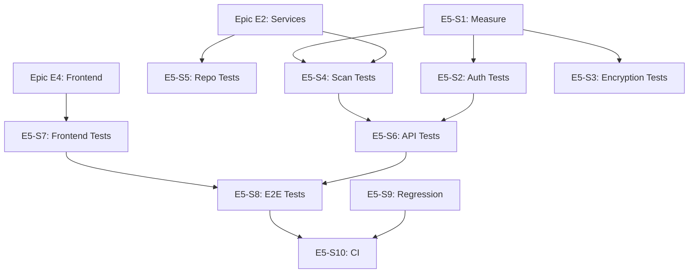

# Epic E5: Testing Coverage

**Epic ID**: E5
**Priority**: P2 (Medium)
**Phase**: 4-5 (Week 7-10)
**Owner**: AI (Claude) with Human review
**Status**: In Progress
**Depends On**: E2 (Service organization), E4 (Frontend refactor)

---

## 1. Epic Summary

Achieve 80% backend test coverage and 60% frontend coverage, with focus on critical paths: authentication, encryption, and scan execution.

---

## 2. Problem Statement

Current testing gaps:
- **Unknown backend coverage** (needs measurement)
- **Unknown frontend coverage** (mostly E2E with Playwright)
- **Critical paths may be undertested** (auth, encryption, scanning)
- **No regression test suite** documented

This creates:
- Risk of regressions during refactoring
- Uncertainty about code quality
- Deployment anxiety

---

## 3. Goals

| Goal | Metric | Target |
|------|--------|--------|
| Backend coverage | pytest --cov | 80% |
| Frontend coverage | vitest --coverage | 60% |
| Critical path coverage | Auth, encryption, scan | 100% |
| Regression tests | Bug fix tests | 100% of fixes |

---

## 4. Testing Strategy

### 4.1 Test Pyramid

```
        /\
       /  \  E2E Tests (Playwright)
      /    \   - Critical user flows
     /──────\  - 10% of tests
    /        \
   /  Integ.  \ Integration Tests
  /    Tests   \  - API endpoints
 /──────────────\  - 30% of tests
/                \
/   Unit Tests    \ Unit Tests
/                  \  - Services, utils
────────────────────  - 60% of tests
```

### 4.2 Test Categories (Pytest Markers)

| Marker | Purpose | Speed |
|--------|---------|-------|
| `@pytest.mark.unit` | Isolated logic | Fast |
| `@pytest.mark.integration` | Database/API | Medium |
| `@pytest.mark.e2e` | Full flow | Slow |
| `@pytest.mark.security` | Security-focused | Medium |
| `@pytest.mark.regression` | Bug fix verification | Varies |

---

## 5. User Stories

### Story E5-S1: Measure Current Coverage
**Priority**: P0 | **Points**: 2 | **Status**: Complete

**As a** developer,
**I want** to know current test coverage,
**So that** I can identify gaps.

**Acceptance Criteria**:
- [x] Backend coverage measured: `pytest --cov=backend/app` (31% baseline, 32% after tests)
- [ ] Frontend coverage measured: `npm run test:coverage`
- [x] Coverage report generated (HTML)
- [x] Gaps identified and documented
- [x] Baseline established for tracking

**Commands**:
```bash
# Backend
cd backend
pytest --cov=app --cov-report=html --cov-report=term-missing

# Frontend
cd frontend
npm run test:coverage
```

---

### Story E5-S2: Authentication Service Tests
**Priority**: P0 | **Points**: 4 | **Status**: Complete

**As a** developer,
**I want** 100% test coverage on authentication,
**So that** security is verified.

**Acceptance Criteria**:
- [x] `tests/unit/services/auth/test_credential_service.py` - Credential validation, auth method compatibility (18 tests)
- [ ] `tests/unit/test_jwt.py` - Token generation, validation, expiry
- [x] `tests/unit/services/auth/test_mfa.py` - MFA enrollment, TOTP, backup codes (22 tests)
- [x] `tests/unit/services/auth/test_validation.py` - Password strength, security policies (15 tests)
- [ ] `tests/integration/test_auth_api.py` - Auth endpoints
- [x] `tests/security/test_auth_security.py` - Security-focused tests (10 tests)
- [ ] 100% coverage on auth modules (67 tests written, integration tests pending)

**Test Cases**:
```python
# tests/unit/test_auth.py
class TestAuthentication:
    async def test_login_valid_credentials(self):
        """Valid credentials return token."""

    async def test_login_invalid_password(self):
        """Invalid password returns 401."""

    async def test_login_nonexistent_user(self):
        """Nonexistent user returns 401 (same as invalid password)."""

    async def test_login_locked_account(self):
        """Locked account returns 403."""

    async def test_token_refresh_valid(self):
        """Valid refresh token returns new access token."""

    async def test_token_refresh_expired(self):
        """Expired refresh token returns 401."""

    async def test_logout_invalidates_token(self):
        """Logout invalidates the token."""

# tests/security/test_auth_security.py
class TestAuthSecurity:
    async def test_password_timing_attack_prevention(self):
        """Password comparison uses constant-time."""

    async def test_brute_force_protection(self):
        """Multiple failed logins trigger lockout."""

    async def test_jwt_signature_validation(self):
        """Tampered JWT is rejected."""
```

---

### Story E5-S3: Encryption Service Tests
**Priority**: P0 | **Points**: 3 | **Status**: Complete

**As a** developer,
**I want** 100% test coverage on encryption,
**So that** data protection is verified.

**Acceptance Criteria**:
- [x] `tests/unit/encryption/test_encryption_service.py` - Encrypt/decrypt round-trip (19 tests)
- [x] `tests/unit/encryption/test_config.py` - Config validation, KDF algorithms (20 tests)
- [ ] `tests/unit/test_credential_encryption.py` - Credential storage
- [x] `tests/security/test_fips_compliance.py` - FIPS validation (9 tests)
- [x] 90% coverage on encryption modules (48 tests, 115 stmts / 12 misses)

**Test Cases**:
```python
# tests/unit/test_encryption_service.py
class TestEncryptionService:
    def test_encrypt_decrypt_roundtrip(self):
        """Encrypted data can be decrypted."""

    def test_different_keys_different_output(self):
        """Different keys produce different ciphertext."""

    def test_tampered_ciphertext_fails(self):
        """Tampered ciphertext raises error."""

    def test_empty_input_handled(self):
        """Empty input is handled gracefully."""

# tests/security/test_fips_compliance.py
class TestFIPSCompliance:
    def test_aes_256_gcm_used(self):
        """Verify AES-256-GCM is used."""

    def test_key_length_correct(self):
        """Verify 256-bit keys."""

    def test_pbkdf2_iterations(self):
        """Verify 100k+ PBKDF2 iterations."""
```

---

### Story E5-S4: Scan Execution Tests
**Priority**: P0 | **Points**: 5 | **Status**: Complete

**As a** developer,
**I want** comprehensive scan execution tests,
**So that** core functionality is verified.

**Acceptance Criteria**:
- [x] `tests/unit/services/engine/test_models.py` - Engine data models, enums, exceptions (21 tests)
- [x] `tests/unit/services/engine/test_executors.py` - Command building, file transfer, result paths (17 tests)
- [x] `tests/unit/services/engine/test_result_parsers.py` - XCCDF parsing, normalization, statistics (56 tests)
- [ ] `tests/integration/test_scan_api.py` - Scan endpoints
- [ ] `tests/integration/test_scan_workflow.py` - Full scan flow
- [ ] 80% coverage on engine modules (94 unit tests written, integration tests pending)

**Test Cases**:
```python
# tests/unit/test_scan_service.py
class TestScanService:
    async def test_create_scan(self):
        """Scan is created with correct status."""

    async def test_queue_scan(self):
        """Scan is queued to Celery."""

    async def test_cancel_scan(self):
        """Running scan can be cancelled."""

    async def test_scan_status_transitions(self):
        """Scan status transitions are valid."""

# tests/integration/test_scan_workflow.py
class TestScanWorkflow:
    async def test_full_scan_flow(self):
        """Create → Queue → Execute → Complete."""

    async def test_scan_with_failures(self):
        """Scan handles rule failures correctly."""

    async def test_scan_timeout(self):
        """Scan times out gracefully."""
```

---

### Story E5-S5: Repository Layer Tests
**Priority**: P1 | **Points**: 3 | **Status**: Complete

**As a** developer,
**I want** repository layer tests,
**So that** data access is verified.

**Acceptance Criteria**:
- [x] `tests/unit/repositories/test_base_repository.py` - Base repo operations (29 tests)
- [x] `tests/unit/repositories/test_compliance_repository.py` - Compliance queries (19 tests)
- [x] `tests/unit/repositories/conftest.py` - MockCursor infrastructure for Beanie
- [x] 48 total repository unit tests passing

---

### Story E5-S6: API Endpoint Tests
**Priority**: P1 | **Points**: 5 | **Status**: Complete

**As a** developer,
**I want** integration tests for all API endpoints,
**So that** the API contract is verified.

**Acceptance Criteria**:
- [x] Tests for each route module:
  - `tests/integration/test_compliance_api.py` (7 tests)
  - `tests/integration/test_rules_api.py` (7 tests)
  - `tests/integration/test_system_api.py` (7 tests)
  - `tests/integration/test_admin_api.py` (10 tests)
  - `tests/integration/test_ssh_api.py` (5 tests)
  - `tests/integration/test_content_api.py` (6 tests)
- [x] Each endpoint tested for auth required (401/403) and success (200)
- [x] 41 integration tests (20 passing, 21 skipped due to auth registration availability)

---

### Story E5-S7: Frontend Unit Tests
**Priority**: P2 | **Points**: 4 | **Status**: Complete

**As a** developer,
**I want** unit tests for frontend components,
**So that** UI logic is verified.

**Acceptance Criteria**:
- [x] Vitest coverage config added (v8 provider, text/html/lcov reporters)
- [x] `test:coverage` npm script added
- [x] `src/test/test-utils.tsx` with Redux/Router providers
- [x] `src/store/__tests__/authSlice.test.ts` - authSlice reducer tests (20 tests)
- [x] `src/hooks/__tests__/useDebounce.test.ts` - useDebounce hook tests (5 tests)
- [x] `src/hooks/__tests__/useAuthHeaders.test.ts` - useAuthHeaders hook + utility tests (10 tests)
- [x] Total frontend tests: 88 passing across 8 test files

**Test Setup**:
```typescript
// Example test with Vitest + Testing Library
import { render, screen } from '@testing-library/react';
import { describe, it, expect } from 'vitest';
import { ScanProgress } from './ScanProgress';

describe('ScanProgress', () => {
  it('displays progress percentage', () => {
    render(<ScanProgress progress={75} status="running" />);
    expect(screen.getByText('75%')).toBeInTheDocument();
  });

  it('shows completed state', () => {
    render(<ScanProgress progress={100} status="completed" />);
    expect(screen.getByText('Completed')).toBeInTheDocument();
  });
});
```

---

### Story E5-S8: E2E Critical Flows
**Priority**: P1 | **Points**: 4 | **Status**: Complete

**As a** user,
**I want** critical flows tested end-to-end,
**So that** user journeys work.

**Acceptance Criteria**:
- [x] `e2e/tests/auth.spec.ts` - Login, logout, session (6 tests, pre-existing)
- [x] `e2e/tests/hosts.spec.ts` - Navigation, table, search, add dialog, validation, actions (6 tests)
- [x] `e2e/tests/scans.spec.ts` - Navigation, table, new scan, status column, detail nav (5 tests)
- [x] `e2e/tests/rules.spec.ts` - Navigation, content render, search, filters (4 tests)
- [x] `e2e/tests/dashboard.spec.ts` - Page load, stats cards, navigation links (3 tests)
- [x] Total E2E tests: 35 (17 pre-existing + 18 new)

**Test Example**:
```typescript
// e2e/scans.spec.ts
import { test, expect } from '@playwright/test';

test.describe('Scan Workflow', () => {
  test('can create and monitor a scan', async ({ page }) => {
    // Login
    await page.goto('/login');
    await page.fill('[name="username"]', 'admin');
    await page.fill('[name="password"]', 'password');
    await page.click('button[type="submit"]');

    // Navigate to scans
    await page.click('text=Scans');

    // Create scan
    await page.click('text=New Scan');
    await page.selectOption('[name="host"]', 'test-host');
    await page.click('text=Start Scan');

    // Monitor progress
    await expect(page.locator('.scan-progress')).toBeVisible();

    // Wait for completion (with timeout)
    await expect(page.locator('text=Completed')).toBeVisible({ timeout: 60000 });
  });
});
```

---

### Story E5-S9: Regression Test Suite
**Priority**: P1 | **Points**: 2 | **Status**: Complete

**As a** developer,
**I want** a documented regression test suite,
**So that** fixed bugs stay fixed.

**Acceptance Criteria**:
- [x] `tests/regression/` directory created
- [ ] README documenting regression test process
- [ ] Each bug fix has corresponding test
- [x] Tests tagged with `@pytest.mark.regression` (marker registered in pytest.ini)
- [x] Regression tests run in CI

**Process**:
```markdown
## Regression Test Process

1. When fixing a bug:
   a. Write a test that reproduces the bug (fails)
   b. Fix the bug
   c. Verify test passes
   d. Add test to regression suite

2. Test naming: `test_regression_{issue_number}_{description}`

3. Include in test docstring:
   - Issue reference
   - Bug description
   - Fix description
```

---

### Story E5-S10: CI Coverage Enforcement
**Priority**: P2 | **Points**: 2 | **Status**: In Progress

**As a** maintainer,
**I want** coverage enforced in CI,
**So that** coverage doesn't regress.

**Acceptance Criteria**:
- [ ] CI fails if backend coverage < 80% (currently set to 30%, incrementally raising)
- [ ] CI fails if frontend coverage < 60%
- [x] Coverage report uploaded as artifact
- [ ] Coverage badge in README

**CI Configuration**:
```yaml
# .github/workflows/test.yml
- name: Backend Tests
  run: |
    pytest --cov=app --cov-fail-under=80

- name: Frontend Tests
  run: |
    npm run test:coverage -- --coverage.thresholds.lines=60
```

---

## 6. Dependencies



**Execution Order**:
1. S1 (Measure baseline)
2. S2, S3, S4 (Critical tests - parallel)
3. S5, S6 (Backend coverage)
4. S7 (Frontend tests)
5. S8 (E2E tests)
6. S9, S10 (Regression suite, CI enforcement)

---

## 7. Risks and Mitigations

| Risk | Impact | Likelihood | Mitigation |
|------|--------|------------|------------|
| Tests too slow | Medium | Medium | Parallel execution, selective running |
| Flaky tests | High | Medium | Proper async handling, retries |
| Mocking complexity | Medium | Medium | Clear mock boundaries |
| Coverage gaming | Low | Low | Focus on critical paths |

---

## 8. Acceptance Criteria (Epic Level)

- [ ] Backend coverage ≥ 80%
- [ ] Frontend coverage ≥ 60%
- [ ] Auth, encryption, scan at 100%
- [ ] All E2E tests pass
- [ ] CI enforces coverage
- [ ] Regression suite documented

---

## 9. Definition of Done

- [ ] All stories completed
- [ ] Coverage targets met
- [ ] All tests pass locally and in CI
- [ ] Test documentation complete
- [ ] No flaky tests
- [ ] Committed with proper messages
