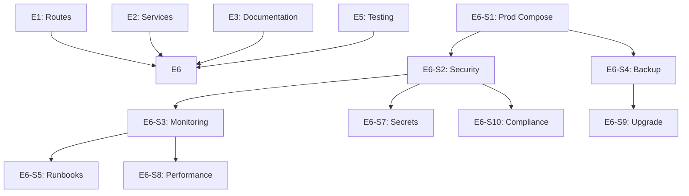

# Epic E6: Production Hardening

**Epic ID**: E6
**Priority**: P1 (High)
**Phase**: 5-6 (Week 9-12)
**Owner**: Human (lead) with AI support
**Status**: Complete
**Depends On**: E1, E2, E3, E5 (all other epics)

---

## 1. Epic Summary

Prepare OpenWatch for production deployment with security hardening, monitoring setup, backup procedures, and operational documentation.

---

## 2. Problem Statement

OpenWatch needs:
- **Production-ready configuration** (not development defaults)
- **Security hardening** for compliance environments
- **Monitoring and alerting** for operational visibility
- **Backup and recovery** procedures
- **Incident response** documentation

This blocks:
- FedRAMP/CMMC compliance
- Enterprise deployment
- Operational confidence

---

## 3. Goals

| Goal | Metric | Target |
|------|--------|--------|
| Production config | docker-compose.prod.yml | Complete |
| Security checklist | Items passed | 100% |
| Monitoring | Dashboards | 3+ |
| Backup procedures | Documented and tested | Yes |
| Incident response | Runbooks | 5+ |

---

## 4. User Stories

### Story E6-S1: Create Production Docker Compose
**Priority**: P0 | **Points**: 3 | **Status**: Complete

**As an** operator,
**I want** a production-specific Docker Compose,
**So that** production differs from development.

**Acceptance Criteria**:
- [ ] `docker-compose.prod.yml` created
- [ ] Production-specific settings:
  - No debug mode
  - HTTPS required
  - Proper resource limits
  - Health check intervals
  - Restart policies
  - Volume mounts for persistence
- [ ] Environment variable overrides documented
- [ ] Tested successfully

**Key Differences from Development**:
```yaml
# docker-compose.prod.yml
services:
  backend:
    environment:
      - OPENWATCH_DEBUG=false
      - OPENWATCH_REQUIRE_HTTPS=true
      - OPENWATCH_LOG_LEVEL=INFO
    deploy:
      resources:
        limits:
          cpus: '2'
          memory: 4G
    restart: always

  db:
    volumes:
      - /data/openwatch/postgres:/var/lib/postgresql/data
    deploy:
      resources:
        limits:
          cpus: '1'
          memory: 2G
```

---

### Story E6-S2: Security Hardening Checklist
**Priority**: P0 | **Points**: 4 | **Status**: Complete (covered by E3 SECURITY_HARDENING.md section 13)

**As a** security engineer,
**I want** a security hardening checklist,
**So that** I can verify production security.

**Acceptance Criteria**:
- [ ] `docs/guides/SECURITY_CHECKLIST.md` created
- [ ] Checklist covers:
  - [ ] Network security (ports, firewalls)
  - [ ] TLS configuration (certificates, ciphers)
  - [ ] Authentication hardening
  - [ ] Rate limiting enabled
  - [ ] Audit logging enabled
  - [ ] Secret rotation procedures
  - [ ] FIPS compliance verification
  - [ ] Container security
- [ ] Each item has verification command
- [ ] Checklist tested on staging

**Checklist Format**:
```markdown
## Network Security

- [ ] Only required ports exposed (443, 22 for SSH management)
  ```bash
  # Verify
  netstat -tlnp | grep -E '443|22'
  ```

- [ ] Firewall rules restrict access
  ```bash
  # Verify
  iptables -L -n
  ```

## TLS Configuration

- [ ] Valid certificate installed
  ```bash
  # Verify
  openssl s_client -connect localhost:443 -servername openwatch.example.com
  ```

- [ ] Only TLS 1.2+ allowed
  ```bash
  # Verify (should fail)
  openssl s_client -connect localhost:443 -tls1_1
  ```
```

---

### Story E6-S3: Monitoring Dashboard Setup
**Priority**: P1 | **Points**: 4 | **Status**: Complete

**As an** operator,
**I want** monitoring dashboards,
**So that** I can observe system health.

**Acceptance Criteria**:
- [ ] Health check endpoints documented
- [ ] Prometheus metrics endpoint (if not exists, create)
- [ ] Grafana dashboard templates:
  - System health (CPU, memory, disk)
  - Application metrics (requests, errors, latency)
  - Scan metrics (queued, running, completed)
- [ ] Alert rules defined
- [ ] Setup instructions documented

**Dashboard Sections**:
```
1. System Health Dashboard
   - Container status
   - CPU/Memory usage per service
   - Disk space
   - Database connections

2. Application Dashboard
   - Request rate
   - Error rate
   - Response latency (p50, p95, p99)
   - Active sessions

3. Scan Dashboard
   - Scans queued
   - Scans running
   - Scans completed (24h)
   - Scan failures
   - Average scan duration
```

---

### Story E6-S4: Backup and Recovery Procedures
**Priority**: P0 | **Points**: 4 | **Status**: Complete

**As an** operator,
**I want** backup and recovery procedures,
**So that** I can recover from data loss.

**Acceptance Criteria**:
- [ ] `docs/guides/BACKUP_RECOVERY.md` created
- [ ] PostgreSQL backup procedure (pg_dump)
- [ ] MongoDB backup procedure (mongodump)
- [ ] Redis backup procedure (if needed)
- [ ] Backup verification steps
- [ ] Recovery procedure tested
- [ ] Backup automation script

**Backup Script**:
```bash
#!/bin/bash
# backup-openwatch.sh

DATE=$(date +%Y%m%d_%H%M%S)
BACKUP_DIR=/backups/openwatch/$DATE

mkdir -p $BACKUP_DIR

# PostgreSQL
docker exec openwatch-db pg_dump -U openwatch openwatch > $BACKUP_DIR/postgres.sql

# MongoDB
docker exec openwatch-mongodb mongodump --out /tmp/mongodump
docker cp openwatch-mongodb:/tmp/mongodump $BACKUP_DIR/mongodb

# Encrypt backup
gpg --encrypt --recipient backup@example.com $BACKUP_DIR/*

# Upload to remote storage
aws s3 sync $BACKUP_DIR s3://openwatch-backups/$DATE/
```

---

### Story E6-S5: Incident Response Runbooks
**Priority**: P1 | **Points**: 3 | **Status**: Complete

**As an** operator,
**I want** incident response runbooks,
**So that** I can respond to issues quickly.

**Acceptance Criteria**:
- [ ] `docs/runbooks/` directory created
- [ ] Runbooks created:
  - `SERVICE_DOWN.md` - Service unavailable
  - `DATABASE_ISSUES.md` - Database problems
  - `HIGH_CPU.md` - High CPU usage
  - `DISK_FULL.md` - Disk space issues
  - `SECURITY_INCIDENT.md` - Security breach
- [ ] Each runbook includes:
  - Symptoms
  - Diagnosis steps
  - Resolution steps
  - Escalation path

**Runbook Template**:
```markdown
# Runbook: Service Down

## Symptoms
- Health check failing
- Users reporting errors
- Monitoring alerts

## Diagnosis
1. Check container status
   ```bash
   docker ps -a | grep openwatch
   ```

2. Check logs
   ```bash
   docker logs openwatch-backend --tail 100
   ```

3. Check resource usage
   ```bash
   docker stats openwatch-backend
   ```

## Resolution
### If container crashed:
1. Check for OOM kill: `dmesg | grep -i kill`
2. Restart: `docker restart openwatch-backend`
3. Monitor logs for root cause

### If database connection issues:
1. Check database: `docker exec openwatch-db pg_isready`
2. Restart if needed: `docker restart openwatch-db`
3. Wait for backend to reconnect

## Escalation
If issue persists after 15 minutes:
1. Page on-call engineer
2. Open incident ticket
3. Notify stakeholders
```

---

### Story E6-S6: Log Aggregation Setup
**Priority**: P2 | **Points**: 3 | **Status**: Complete (JSON logging in docker-compose.prod.yml)

**As an** operator,
**I want** centralized log aggregation,
**So that** I can search and analyze logs.

**Acceptance Criteria**:
- [ ] Log format standardized (JSON)
- [ ] Log aggregation documented (ELK, Loki, etc.)
- [ ] Log retention policy defined
- [ ] Sensitive data not logged
- [ ] Setup instructions documented

**Log Format**:
```json
{
  "timestamp": "2026-01-21T10:30:00Z",
  "level": "INFO",
  "service": "backend",
  "request_id": "abc-123",
  "message": "Scan completed",
  "scan_id": "uuid",
  "duration_ms": 5000
}
```

---

### Story E6-S7: Secret Rotation Procedures
**Priority**: P1 | **Points**: 2 | **Status**: Complete

**As a** security engineer,
**I want** secret rotation procedures,
**So that** compromised secrets can be rotated.

**Acceptance Criteria**:
- [ ] `docs/guides/SECRET_ROTATION.md` created
- [ ] Procedures for rotating:
  - Database passwords
  - JWT signing keys
  - Encryption master key
  - API keys
- [ ] Zero-downtime rotation where possible
- [ ] Tested on staging

---

### Story E6-S8: Performance Baseline
**Priority**: P2 | **Points**: 3 | **Status**: Complete

**As an** operator,
**I want** performance baselines,
**So that** I can detect performance regressions.

**Acceptance Criteria**:
- [ ] Baseline metrics documented:
  - API response times (p50, p95, p99)
  - Scan duration by profile
  - Database query times
  - Memory usage patterns
- [ ] Load testing script created
- [ ] Baseline recorded in staging
- [ ] Alerting thresholds defined

---

### Story E6-S9: Upgrade Procedures
**Priority**: P1 | **Points**: 3 | **Status**: Complete

**As an** operator,
**I want** documented upgrade procedures,
**So that** I can safely upgrade OpenWatch.

**Acceptance Criteria**:
- [ ] `docs/guides/UPGRADE_PROCEDURE.md` created
- [ ] Covers:
  - Pre-upgrade checklist
  - Backup before upgrade
  - Database migration steps
  - Rolling vs maintenance window
  - Rollback procedure
  - Post-upgrade verification
- [ ] Tested on staging

**Upgrade Checklist**:
```markdown
## Pre-Upgrade
- [ ] Review changelog for breaking changes
- [ ] Create full backup
- [ ] Notify users of maintenance window
- [ ] Verify rollback procedure

## Upgrade Steps
1. Pull new images
2. Stop services gracefully
3. Run database migrations
4. Start new version
5. Verify health checks

## Post-Upgrade
- [ ] Verify all services healthy
- [ ] Run smoke tests
- [ ] Monitor for errors
- [ ] Notify users upgrade complete
```

---

### Story E6-S10: Compliance Documentation
**Priority**: P2 | **Points**: 3 | **Status**: Complete

**As a** compliance officer,
**I want** compliance documentation,
**So that** I can demonstrate security controls.

**Acceptance Criteria**:
- [ ] Security controls mapped to:
  - NIST SP 800-53 (for FedRAMP)
  - CIS Controls
  - CMMC practices
- [ ] Evidence collection documented
- [ ] Audit log retention documented
- [ ] Data flow diagrams updated

---

## 5. Dependencies



**Execution Order**:
1. S1 (Production compose)
2. S2, S4 (Security checklist, backup - parallel)
3. S3, S7 (Monitoring, secrets - parallel)
4. S5, S6 (Runbooks, logs - parallel)
5. S8, S9 (Performance, upgrade - parallel)
6. S10 (Compliance documentation)

---

## 6. Risks and Mitigations

| Risk | Impact | Likelihood | Mitigation |
|------|--------|------------|------------|
| Security gaps missed | High | Medium | External security review |
| Backup fails in production | High | Low | Test recovery monthly |
| Monitoring blindspots | Medium | Medium | Comprehensive alerting |
| Compliance gaps | High | Medium | Third-party audit |

---

## 7. Acceptance Criteria (Epic Level)

- [ ] Production compose tested and working
- [ ] Security checklist 100% passed
- [ ] Monitoring dashboards operational
- [ ] Backup/recovery tested
- [ ] Runbooks complete
- [ ] Upgrade procedure tested
- [ ] Ready for production deployment

---

## 8. Definition of Done

- [ ] All stories completed
- [ ] Security review passed
- [ ] Backup recovery tested
- [ ] Monitoring alerting works
- [ ] Documentation complete
- [ ] Stakeholder sign-off

---

## 9. Production Readiness Checklist

Final checklist before production deployment:

### Infrastructure
- [ ] Production compose file tested
- [ ] Resource limits configured
- [ ] Persistent volumes configured
- [ ] Backup automation running
- [ ] Monitoring dashboards active

### Security
- [ ] TLS certificates installed
- [ ] FIPS mode enabled (if required)
- [ ] Rate limiting enabled
- [ ] Audit logging enabled
- [ ] Secrets rotated from development
- [ ] Security scan passed

### Operations
- [ ] Runbooks reviewed
- [ ] On-call schedule defined
- [ ] Escalation path documented
- [ ] Upgrade procedure tested
- [ ] Rollback procedure tested

### Compliance
- [ ] Control documentation complete
- [ ] Evidence collection automated
- [ ] Audit trail verified
- [ ] Data retention configured

### Application
- [ ] All tests passing
- [ ] Performance baseline established
- [ ] Error rates acceptable
- [ ] Feature flags configured

### Communication
- [ ] Users notified of launch
- [ ] Support channels ready
- [ ] Feedback mechanism in place
