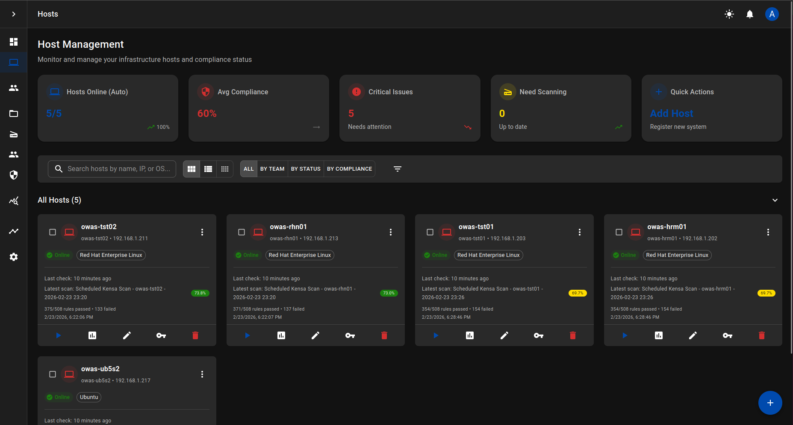

# OpenWatch

**The Compliance Operating System — See Everything, Continuously.**

[](LICENSE)
[](https://github.com/Hanalyx/OpenWatch/actions/workflows/ci.yml)
[](https://hanalyx.github.io/OpenWatch/)
[](https://github.com/Hanalyx/OpenWatch/discussions)

---

An auditor asks: *"Were these 200 servers compliant with STIG on January 15th?"*

With manual processes, that question takes a week to answer. With point-in-time scanning tools, you can only answer if you happened to scan that day. With OpenWatch, it is a query — executed in seconds, backed by machine-verifiable evidence, exportable as CSV, JSON, or PDF.

OpenWatch is the compliance operating system for teams managing Linux infrastructure under STIG, CIS, NIST 800-53, PCI-DSS, and FedRAMP. It connects to your servers over SSH, runs 338 compliance checks via the [Kensa](https://github.com/Hanalyx/kensa) engine, and provides continuous visibility into compliance posture — not just what's passing now, but what was passing last Tuesday, what drifted since your last assessment, and what needs attention before your next one.



## The Problem with Point-in-Time Compliance

Most compliance tools scan your systems and tell you what's passing today. That's useful, but it is not enough:

- **The posture decays immediately.** A server that passed STIG on Monday can drift by Wednesday. Without continuous monitoring, you won't know until the next audit.
- **Historical questions are unanswerable.** "Were we compliant during the assessment window?" requires re-scanning, which only tells you about *now*, not *then*.
- **Exceptions live in spreadsheets.** Approved deviations from policy are tracked in email threads and shared drives, disconnected from the scanning tool.
- **Drift is invisible.** When a rule that was passing starts failing, no one notices until an assessor finds it.
- **Evidence is assembled, not generated.** Teams spend days before an audit compiling screenshots and command outputs into binders.

OpenWatch solves all five problems.

## What OpenWatch Does

### Continuous Compliance Posture

Scan your fleet on a schedule — or let OpenWatch adapt the schedule based on host health. Healthy servers scan every 15 minutes. Degraded servers every 5. Critical servers every 2. The posture dashboard updates in real time.

### Temporal Compliance Queries

Ask "What was our STIG compliance on February 1st?" and get an answer backed by historical scan data. OpenWatch captures daily posture snapshots and stores the full history. Compliance posture is not a snapshot; it is a timeline.

### Compliance Drift Detection

When a rule that was passing starts failing, OpenWatch raises an alert automatically. Track drift events through acknowledgment to resolution. Know the moment your posture degrades — not weeks later when an assessor tells you.

### Governance and Exception Management

Some controls require approved exceptions. OpenWatch provides structured exception workflows: request, approve, reject, time-limit, revoke — all with an audit trail. No more tracking waivers in spreadsheets.

### Audit-Ready Evidence and Exports

Every check captures the exact command executed, the system's raw output, the expected value, and the actual value. Export compliance data as CSV, JSON, or PDF. Build saved queries for recurring audit requests. The evidence is generated by the scan, not assembled after the fact.

### Multi-Framework, Single Scan

One scan maps findings to STIG, CIS, NIST 800-53, PCI-DSS, and FedRAMP simultaneously. The same evidence satisfies multiple assessors. No duplicate scans, no duplicate reports.

## How It Compares

| | OpenWatch | Manual Checks | OpenSCAP CLI | Nessus / Tenable |
|---|---|---|---|---|
| Multi-host scanning | One click, 100+ hosts | SSH into each server | Script it yourself | Agent or credentialed scan |
| Dashboard and history | Built-in | Spreadsheets | None | Commercial dashboard |
| Temporal compliance | Query any date | Impossible | None | Limited |
| Drift detection | Automatic alerts | Manual discovery | None | Partial |
| Exception workflows | Structured with audit trail | Spreadsheets and email | None | None |
| Framework coverage | STIG + CIS + NIST + PCI + FedRAMP | Whatever you check | STIG/CIS | CIS/STIG/PCI |
| Remediation | 23 typed mechanisms with rollback | Run commands by hand | Bash scripts | None |
| Evidence model | Structured JSON per check | Screenshots | XML | PDF reports |
| Setup time | 10 minutes | N/A | Hours | Days + licensing |
| Cost | Free (Community) / Paid (Pro) | Labor | Free | $50K+/year |

## Deploy in 10 Minutes

**Requirements:** Docker (or Podman) and 4 GB RAM.

```bash
git clone https://github.com/hanalyx/openwatch.git
cd openwatch
./start-openwatch.sh --runtime docker --build
```

Wait ~90 seconds, then open **http://localhost:3000**. Default login: `admin` / `admin`.

**Change the default password immediately.**

### Run Your First Scan

1. **Add credentials** — Settings > System Credentials > add your SSH user/key
2. **Add a host** — Hosts > Add Host > enter IP, select credentials
3. **Scan** — Click the play button on the host card

Results appear in under a minute. No SCAP content to download, no XML to wrangle — OpenWatch ships with 338 built-in [Kensa](https://github.com/Hanalyx/kensa) rules ready to go.

## Architecture

```
┌─────────────────────────────────────────────────────────────┐
│                       You / Your Team                       │
└──────────────────────────┬──────────────────────────────────┘
                           │
┌──────────────────────────▼──────────────────────────────────┐
│  OpenWatch UI (React 19 · Material-UI v7)                   │
│  Dashboard · Posture · Alerts · Exceptions · Reports        │
├─────────────────────────────────────────────────────────────┤
│  OpenWatch API (FastAPI · 80+ endpoints)                    │
│  Auth · RBAC · Scheduling · Audit · Exports                 │
├────────────────────────┬────────────────────────────────────┤
│  Kensa Engine          │  Celery Workers                    │
│  338 YAML rules        │  Async scanning                   │
│  23 remediation types  │  Adaptive scheduling              │
│  Evidence capture      │  Drift detection                  │
├────────────────────────┴────────────────────────────────────┤
│  PostgreSQL 15         │  Redis 7.4                         │
│  All persistent data   │  Task queue + cache               │
└────────────────────────┴────────────────────────────────────┘
                           │
                      SSH (port 22)
                           │
┌──────────────────────────▼──────────────────────────────────┐
│            Your Linux Servers (RHEL 8/9, Rocky, Alma)       │
└─────────────────────────────────────────────────────────────┘
```

## Security

OpenWatch is built for environments where security is the requirement, not an afterthought:

| Control | Implementation |
|---|---|
| Encryption at rest | AES-256-GCM for stored credentials and sensitive data |
| Authentication | RS256 JWT with Argon2id password hashing |
| Multi-factor auth | TOTP (Google Authenticator, Authy) with backup codes |
| FIPS 140-2 | Compliant cryptography (enable via `OPENWATCH_FIPS_MODE=true`) |
| Authorization | RBAC with 6 roles — Superadmin, Security Admin, Analyst, Compliance Officer, Auditor, Guest |
| Audit logging | All authentication, authorization, and compliance events logged |
| Rate limiting | 100 req/min per user, 1,000 req/min per IP |
| Transport | TLS 1.2+ with FIPS cipher suites in production |
| Target security | No agents — scans over SSH, nothing installed on targets |

Report vulnerabilities to security@hanalyx.com.

## API-First Design

OpenWatch exposes 80+ REST API endpoints. Everything you can do in the UI, you can automate:

```bash
# Authenticate
TOKEN=$(curl -s -X POST http://localhost:8000/api/auth/login \
  -H "Content-Type: application/json" \
  -d '{"username":"admin","password":"admin"}' | jq -r '.access_token')

# Add a host
HOST_ID=$(curl -s -X POST http://localhost:8000/api/hosts/ \
  -H "Authorization: Bearer $TOKEN" \
  -H "Content-Type: application/json" \
  -d '{"hostname":"web-01","ip_address":"192.168.1.10","ssh_port":22}' | jq -r '.id')

# Run an Aegis compliance scan
SCAN_ID=$(curl -s -X POST http://localhost:8000/api/scans/aegis \
  -H "Authorization: Bearer $TOKEN" \
  -H "Content-Type: application/json" \
  -d "{\"host_id\":\"$HOST_ID\",\"framework\":\"cis-rhel9-v2.0.0\"}" | jq -r '.scan_id')

# Get results
curl -s http://localhost:8000/api/scans/$SCAN_ID/results \
  -H "Authorization: Bearer $TOKEN" | jq '.compliance_percentage'
```

Integrate compliance scanning into CI/CD pipelines, SIEM platforms, or custom dashboards.

## Administration: owadm

The `owadm` CLI manages your OpenWatch deployment (Docker and Podman):

```bash
owadm start              # Start all services
owadm stop               # Stop services (data preserved)
owadm status             # Service health overview
owadm logs -f backend    # Follow backend logs
owadm create-admin       # Create admin user
owadm db-migrate         # Run database migrations
owadm health             # Health check
```

## Production Deployment

For production environments, use the hardened configuration:

```bash
# Generate secure secrets
owadm generate-secrets

# Deploy with production settings
docker compose -f docker-compose.yml -f docker-compose.prod.yml up -d
```

Production mode enables: HTTPS (443/80), FIPS cryptography, resource limits (2 CPU / 4 GB backend, 4 CPU / 8 GB worker), JSON logging with rotation, and tightened health checks.

RPM packages and systemd units are available in `packaging/` for bare-metal deployments with SELinux policy modules included.

## Monitoring

Deploy the built-in monitoring stack:

```bash
docker compose -f monitoring/docker-compose.monitoring.yml up -d
```

Includes Prometheus metric collection, three pre-built Grafana dashboards (System Health, Application Performance, Compliance Trends), and Alertmanager integration.

## Documentation

| Topic | Link |
|---|---|
| API Reference | [Swagger UI](http://localhost:8000/api/docs) (when running) |
| Full Documentation | [hanalyx.github.io/OpenWatch](https://hanalyx.github.io/OpenWatch/) |
| First Run Setup | [docs/FIRST_RUN_SETUP.md](docs/FIRST_RUN_SETUP.md) |
| Production Deployment | [docs/guides/PRODUCTION_DEPLOYMENT.md](docs/guides/PRODUCTION_DEPLOYMENT.md) |
| Security Hardening | [docs/guides/SECURITY_HARDENING.md](docs/guides/SECURITY_HARDENING.md) |
| Development Workflow | [docs/DEVELOPMENT_WORKFLOW.md](docs/DEVELOPMENT_WORKFLOW.md) |

## Part of the Hanalyx Compliance Platform

OpenWatch is the compliance operating system — the dashboard, the scheduler, the governance layer.  **[Kensa](https://github.com/Hanalyx/kensa)** is the compliance engine underneath — 508 rules, 23 remediation mechanisms, automatic rollback, all over SSH.

If you want a CLI that integrates into scripts and pipelines, start with Kensa. If you want a platform for your team with a dashboard, scheduling, and audit workflows, start here.

## Community

Have a question, idea, or want to share how you're using OpenWatch?

**[Join the Discussion](https://github.com/Hanalyx/OpenWatch/discussions)**

- **Q&A** — Get help with setup, scanning, and configuration
- **Ideas** — Propose features and integrations
- **Show and Tell** — Share your compliance workflows

Found a bug? [Open an issue](https://github.com/Hanalyx/OpenWatch/issues/new).

## Contributing

```bash
# Backend
cd backend && pip install -r requirements.txt
pytest tests/ -v

# Frontend
cd frontend && npm install
npm run dev    # http://localhost:3001
npm test
```

See [CONTRIBUTING.md](CONTRIBUTING.md) before submitting a PR.

## License

**OpenWatch Community License (AGPLv3 + Managed Service Exception)**

- Free to use, modify, and self-host
- Cannot offer as a managed/hosted service without a commercial license

See [LICENSE](LICENSE) for details. Commercial licensing: [legal@hanalyx.com](mailto:legal@hanalyx.com)
