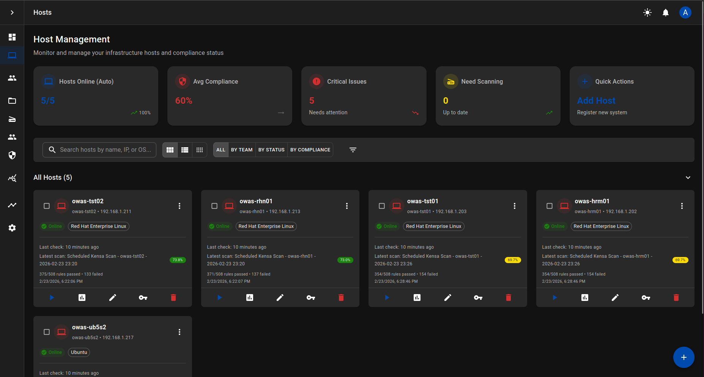

# OpenWatch

**The Compliance Operating System — See Everything, Continuously.**

[](LICENSE)
[](https://github.com/Hanalyx/OpenWatch/actions/workflows/go-ci.yml)
[](https://hanalyx.github.io/OpenWatch/)
[](https://github.com/Hanalyx/OpenWatch/discussions)

---

An auditor asks: *"Were these 200 servers compliant with STIG on January 15th?"*

With manual processes, that question takes a week to answer. With point-in-time scanning tools, you can only answer if you happened to scan that day. With OpenWatch, it is a query — executed in seconds, backed by machine-verifiable evidence, exportable as CSV, JSON, or PDF.

OpenWatch is the compliance operating system for teams managing Linux infrastructure under STIG, CIS, NIST 800-53, PCI-DSS, and FedRAMP. It connects to your servers over SSH, runs 508 compliance checks via the [Kensa](https://github.com/Hanalyx/kensa) engine, and provides continuous visibility into compliance posture — not just what's passing now, but what was passing last Tuesday, what drifted since your last assessment, and what needs attention before your next one.

> **Project status — Go rebuild, pre-release.** OpenWatch is a single Go binary
> that serves both the REST API and the embedded React UI (the original
> Python/FastAPI implementation was archived out of the repo on 2026-06-05). The
> Go tree lives at the **repo root**: Go 1.26 backend (`cmd/`, `internal/`),
> React 19 + TanStack frontend (`frontend/`), PostgreSQL-only. The current
> version is `0.2.0-rc.8`, a pre-release — not a GA build.



## The Problem with Point-in-Time Compliance

Most compliance tools scan your systems and tell you what's passing today. That's useful, but it is not enough:

- **The posture decays immediately.** A server that passed STIG on Monday can drift by Wednesday. Without continuous monitoring, you won't know until the next audit.
- **Historical questions are unanswerable.** "Were we compliant during the assessment window?" requires re-scanning, which only tells you about *now*, not *then*.
- **Exceptions live in spreadsheets.** Approved deviations from policy are tracked in email threads and shared drives, disconnected from the scanning tool.
- **Drift is invisible.** When a rule that was passing starts failing, no one notices until an assessor finds it.
- **Evidence is assembled, not generated.** Teams spend days before an audit compiling screenshots and command outputs into binders.

OpenWatch solves all five problems.

## What OpenWatch Does

### Continuous Compliance Posture

Scan your fleet on a schedule — or let OpenWatch adapt the schedule based on host health. Healthy servers scan every 15 minutes. Degraded servers every 5. Critical servers every 2. The posture dashboard updates in real time.

### Temporal Compliance Queries

Ask "What was our STIG compliance on February 1st?" and get an answer backed by historical scan data. OpenWatch captures daily posture snapshots and stores the full history. Compliance posture is not a snapshot; it is a timeline.

### Compliance Drift Detection

When a rule that was passing starts failing, OpenWatch raises an alert automatically. Track drift events through acknowledgment to resolution. Know the moment your posture degrades — not weeks later when an assessor tells you.

### Governance and Exception Management

Some controls require approved exceptions. OpenWatch provides structured exception workflows: request, approve, reject, time-limit, revoke — all with an audit trail. No more tracking waivers in spreadsheets.

### Audit-Ready Evidence and Exports

Every check captures the exact command executed, the system's raw output, the expected value, and the actual value. Export compliance data as CSV, JSON, or PDF. Build saved queries for recurring audit requests. The evidence is generated by the scan, not assembled after the fact.

### Multi-Framework, Single Scan

One scan maps findings to STIG, CIS, NIST 800-53, PCI-DSS, and FedRAMP simultaneously. The same evidence satisfies multiple assessors. No duplicate scans, no duplicate reports.

## How It Compares

OpenWatch is a compliance *platform* — it manages the lifecycle of compliance across a fleet, not just the scan itself. This table compares approaches to managing ongoing compliance posture:

| | OpenWatch | Manual Processes | Point-in-Time Scanners | Enterprise Platforms (Tenable, etc.) |
|---|---|---|---|---|
| Multi-host scanning | One click, 100+ hosts | SSH into each server | Script it yourself | Agent or credentialed scan |
| Dashboard and history | Built-in | Spreadsheets | None | Commercial dashboard |
| Temporal compliance | Query any date | Impossible | Not available | Limited |
| Drift detection | Automatic alerts | Manual discovery | Not available | Partial |
| Exception workflows | Structured with audit trail | Spreadsheets and email | Not available | Not available |
| Framework coverage | STIG + CIS + NIST + PCI + FedRAMP | Whatever you check | Per-benchmark profiles | CIS/STIG/PCI |
| Remediation | 23 typed mechanisms with rollback | Run commands by hand | Basic scripts | Not available |
| Evidence model | Structured JSON per check | Screenshots | Varies by tool | PDF reports |
| Setup time | 10 minutes | N/A | Varies | Days + licensing |
| Cost | Free (Community) / Paid (Pro) | Labor | Free - varies | $50K+/year |

**Note:** OpenWatch's scanning engine is [Kensa](https://github.com/Hanalyx/kensa), which takes a different architectural approach than SCAP-based tools. Kensa separates rules from implementations, treats frameworks as metadata, and detects host capabilities at runtime. Organizations with SCAP mandate requirements can use SCAP tools for assessment alongside OpenWatch for remediation, governance, and continuous monitoring.

## Deploy in 10 minutes

**Requirements:** a Linux host (RHEL/Rocky/Fedora/Oracle or Ubuntu/Debian),
PostgreSQL, and 4 GB RAM. No Docker, Podman, or containers are required.

```bash
sudo dnf install ./openwatch-*.rpm     # RHEL / Rocky / Fedora / Oracle
sudo apt install ./openwatch_*.deb     # Ubuntu / Debian

sudo openwatch migrate                 # apply database migrations
sudo openwatch create-admin \          # create the first admin user
  --username admin --email you@example.com --password '...'
sudo systemctl enable --now openwatch  # start at boot
```

Open **https://localhost:8443** and sign in with the admin user you created.

### Run your first scan

1. **Add credentials** — Settings > System Credentials > add your SSH user/key
2. **Add a host** — Hosts > Add Host > enter IP, select credentials
3. **Scan** — Click the play button on the host card

Results appear in under a minute. OpenWatch ships with 508 built-in [Kensa](https://github.com/Hanalyx/kensa) rules — human-readable YAML, not XML — ready to go.

## Architecture

```
┌─────────────────────────────────────────────────────────────┐
│                       You / Your Team                       │
└──────────────────────────┬──────────────────────────────────┘
                           │
┌──────────────────────────▼──────────────────────────────────┐
│  OpenWatch UI (React 19 · TanStack Router/Query · MUI)      │
│  Dashboard · Posture · Alerts · Exceptions · Reports        │
├─────────────────────────────────────────────────────────────┤
│  OpenWatch API (Go 1.26 · REST)                             │
│  Auth · RBAC · Scheduling · Audit · Exports                 │
├────────────────────────┬────────────────────────────────────┤
│  Kensa Engine          │  Worker (Go)                       │
│  508 YAML rules        │  Async scanning                   │
│  23 remediation types  │  Adaptive scheduling              │
│  Evidence capture      │  Drift detection                  │
├────────────────────────┴────────────────────────────────────┤
│  PostgreSQL                                                 │
│  All persistent data + native job queue (SKIP LOCKED)      │
└─────────────────────────────────────────────────────────────┘
                           │
                      SSH (port 22)
                           │
┌──────────────────────────▼──────────────────────────────────┐
│            Your Linux Servers (RHEL 8/9, Rocky, Alma)       │
└─────────────────────────────────────────────────────────────┘
```

## Security

OpenWatch is built for environments where security is the requirement, not an afterthought:

| Control | Implementation |
|---|---|
| Encryption at rest | AES-256-GCM for stored credentials and sensitive data |
| Authentication | RS256 JWT with Argon2id password hashing |
| Multi-factor auth | TOTP (Google Authenticator, Authy) with backup codes |
| FIPS 140-2 | Compliant cryptography (enable via `OPENWATCH_FIPS_MODE=true`) |
| Authorization | RBAC with 6 roles — Superadmin, Security Admin, Analyst, Compliance Officer, Auditor, Guest |
| Audit logging | All authentication, authorization, and compliance events logged |
| Rate limiting | 100 req/min per user, 1,000 req/min per IP |
| Transport | TLS 1.2+ with FIPS cipher suites in production |
| Target security | No agents — scans over SSH, nothing installed on targets |

Report vulnerabilities to security@hanalyx.com.

## API-First Design

OpenWatch exposes a versioned REST API under `/api/v1/`. The contract lives in
`api/openapi.yaml` (the source of truth). Everything you can do in the UI, you
can automate:

```bash
# Authenticate
TOKEN=$(curl -sk -X POST https://localhost:8443/api/v1/auth/login \
  -H "Content-Type: application/json" \
  -d '{"username":"admin","password":"..."}' | jq -r '.access_token')

# Add a host
HOST_ID=$(curl -sk -X POST https://localhost:8443/api/v1/hosts \
  -H "Authorization: Bearer $TOKEN" \
  -H "Content-Type: application/json" \
  -d '{"hostname":"web-01","ip_address":"192.168.1.10","ssh_port":22}' | jq -r '.id')

# List hosts
curl -sk https://localhost:8443/api/v1/hosts \
  -H "Authorization: Bearer $TOKEN" | jq '.'
```

Integrate compliance scanning into CI/CD pipelines, SIEM platforms, or custom dashboards.

## Administration

OpenWatch is a single binary. Service lifecycle is managed by **systemd**; admin
operations are subcommands of the `openwatch` binary itself:

```bash
# Service lifecycle (systemd unit installed by the RPM/DEB)
systemctl start openwatch        # start the service
systemctl status openwatch       # service status
journalctl -u openwatch -f       # follow logs

# Admin operations (openwatch subcommands)
openwatch migrate                # apply pending database migrations
openwatch create-admin \         # create the first admin user
  --username admin --email admin@example.com --password '...'
openwatch check-config           # validate and print the resolved config
openwatch --version              # build metadata

# Health
curl -k https://localhost:8443/api/v1/health
```

## Production Deployment

Install the native package (see [docs/guides/INSTALLATION.md](docs/guides/INSTALLATION.md)):

```bash
sudo dnf install ./openwatch-*.rpm     # RHEL / Rocky / Fedora / Oracle
sudo apt install ./openwatch_*.deb     # Ubuntu / Debian

sudo openwatch migrate                 # apply migrations
sudo openwatch create-admin --username admin --email you@example.com --password '...'
sudo systemctl enable --now openwatch  # start at boot
```

The package installs the `openwatch` binary (API + embedded UI), a hardened
systemd unit, default config under `/etc/openwatch/`, and a system user.
Replace the demo TLS cert under `/etc/openwatch/tls/` with your own before
production use. FIPS-mode builds are available via `make build-fips`.

## Monitoring

OpenWatch exposes Prometheus metrics and a liveness probe for external
monitoring:

```bash
curl -k https://localhost:8443/api/v1/health
```

See [docs/guides/MONITORING_SETUP.md](docs/guides/MONITORING_SETUP.md) for
wiring Prometheus, Grafana dashboards, and alerting against the metrics
endpoint.

## Documentation

| Topic | Link |
|---|---|
| API contract | [api/openapi.yaml](api/openapi.yaml) (source of truth) |
| API guide | [docs/guides/API_GUIDE.md](docs/guides/API_GUIDE.md) |
| Full documentation | [hanalyx.github.io/OpenWatch](https://hanalyx.github.io/OpenWatch/) |
| Quickstart | [docs/guides/QUICKSTART.md](docs/guides/QUICKSTART.md) |
| Production deployment | [docs/guides/PRODUCTION_DEPLOYMENT.md](docs/guides/PRODUCTION_DEPLOYMENT.md) |
| Security hardening | [docs/guides/SECURITY_HARDENING.md](docs/guides/SECURITY_HARDENING.md) |
| Engineering docs | [docs/engineering/](docs/engineering/) |

## Part of the Hanalyx Compliance Platform

OpenWatch is the compliance operating system — the dashboard, the scheduler, the governance layer.  **[Kensa](https://github.com/Hanalyx/kensa)** is the compliance engine underneath — 508 rules, 23 remediation mechanisms, automatic rollback, all over SSH.

If you want a CLI that integrates into scripts and pipelines, start with Kensa. If you want a platform for your team with a dashboard, scheduling, and audit workflows, start here.

## Community

Have a question, idea, or want to share how you're using OpenWatch?

**[Join the Discussion](https://github.com/Hanalyx/OpenWatch/discussions)**

- **Q&A** — Get help with setup, scanning, and configuration
- **Ideas** — Propose features and integrations
- **Show and Tell** — Share your compliance workflows

Found a bug? [Open an issue](https://github.com/Hanalyx/OpenWatch/issues/new).

## Contributing

The Go tree lives at the repo root:

```bash
# Backend (Go 1.26)
go build ./...
go test ./internal/... -count=1
specter check          # spec schema validation

# Frontend (React 19 + TanStack + Vite)
cd frontend
npm install
npm run dev            # http://localhost:5173
npx vitest run
```

The legacy Python implementation is archived outside the repo and is no longer
built or tested here. See [CONTRIBUTING.md](CONTRIBUTING.md) before submitting a PR.

## License

**OpenWatch Community License (AGPLv3 + Managed Service Exception)**

- Free to use, modify, and self-host
- Cannot offer as a managed/hosted service without a commercial license

See [LICENSE](LICENSE) for details. Commercial licensing: [legal@hanalyx.com](mailto:legal@hanalyx.com)
