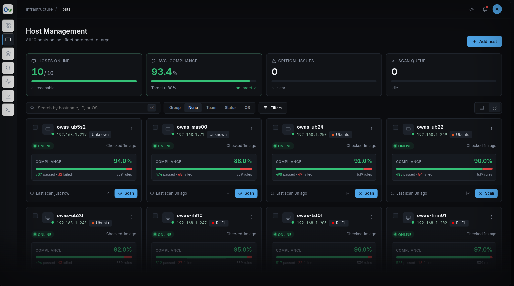

# OpenWatch

**The Compliance Operating System. See Everything, Continuously.**

[](LICENSE)
[](https://github.com/Hanalyx/OpenWatch/actions/workflows/go-ci.yml)
[](https://hanalyx.github.io/OpenWatch/)
[](https://github.com/Hanalyx/OpenWatch/discussions)

---

An auditor asks: *"Were these 200 servers compliant with STIG on January 15th?"*

With manual processes, that question takes a week to answer. With point-in-time
scanning tools, you can only answer it if you happened to scan that day. With
OpenWatch, it is a query: answered in seconds, backed by machine-verifiable
evidence, exportable as CSV, JSON, PDF or OSCAL.

OpenWatch is a continuous compliance platform for Linux fleets under CIS,
STIG, NIST 800-53, NIST 800-171, CMMC Level 2 and PCI DSS. It connects to your
servers over SSH, runs the 779-rule [Kensa](https://github.com/Hanalyx/kensa)
corpus, and keeps posture
as a timeline: what is passing now, what was passing last Tuesday, what
drifted since your last assessment, and what needs attention before the next
one. **[Read the introduction](docs/guides/INTRODUCTION.md)** for what it does
and how it is built.

> **Project status: Go rebuild, generally available.** OpenWatch is a single Go
> binary that serves both the REST API and the embedded React UI (the original
> Python/FastAPI implementation was archived out of the repo on 2026-06-05). The
> Go tree lives at the **repo root**: Go 1.26 backend (`cmd/`, `internal/`),
> React 19 + TanStack frontend (`frontend/`), PostgreSQL-only. The current
> version is `0.8.0-rc.5`, on the general-availability line that opened with `0.2.0`.



## Deploy in 10 minutes

**Requirements:** a Linux host (RHEL/Rocky/Fedora/Oracle or Ubuntu/Debian),
PostgreSQL, and 4 GB RAM. No Docker, Podman, or containers are required.

```bash
sudo dnf install ./openwatch-*.rpm ./kensa-rules-*.noarch.rpm   # RHEL / Rocky / Fedora / Oracle
sudo apt install ./openwatch_*.deb ./kensa-rules_*.deb          # Ubuntu / Debian

sudo openwatch setup                   # provision PostgreSQL, migrate, create the admin, start
```

`kensa-rules` is the rule corpus; the `openwatch` package requires it. `setup`
shows its plan and waits for confirmation before changing anything; the
[installation guide](docs/guides/INSTALLATION.md) covers every option and the
manual path.

Open **https://localhost:8443** and sign in with the admin user you created.

### Run your first scan

1. **Add credentials**: Settings > System Credentials > add your SSH user/key
2. **Add a host**: Hosts > Add Host > enter IP, select credentials
3. **Scan**: Click **Scan** on the host card

Results appear in under a minute. OpenWatch ships with the built-in [Kensa](https://github.com/Hanalyx/kensa) rule corpus (the count per framework is kept in [one place](docs/guides/SCANNING_AND_COMPLIANCE.md#available-frameworks)): human-readable YAML, not XML, ready to go.

## Documentation

Start with the [introduction](docs/guides/INTRODUCTION.md): the problem,
what OpenWatch does, how it compares, the architecture and the security
model. Then three starting points: an **operator** reads
[Installation](docs/guides/INSTALLATION.md), then the
[Quickstart](docs/guides/QUICKSTART.md), then
[Scanning and compliance](docs/guides/SCANNING_AND_COMPLIANCE.md); an
**administrator** reads [User roles](docs/guides/USER_ROLES.md) and the
[runbooks](docs/runbooks/); a **contributor** reads [AGENTS.md](AGENTS.md) and
[CONTRIBUTING.md](CONTRIBUTING.md). The full index is [docs/README.md](docs/README.md).

| Topic | Link |
|---|---|
| Introduction | [docs/guides/INTRODUCTION.md](docs/guides/INTRODUCTION.md) |
| API contract | [api/openapi.yaml](api/openapi.yaml) (source of truth) |
| API guide | [docs/guides/API_GUIDE.md](docs/guides/API_GUIDE.md) |
| Full documentation | [hanalyx.github.io/OpenWatch](https://hanalyx.github.io/OpenWatch/) |
| Quickstart | [docs/guides/QUICKSTART.md](docs/guides/QUICKSTART.md) |
| Production deployment | [docs/guides/PRODUCTION_DEPLOYMENT.md](docs/guides/PRODUCTION_DEPLOYMENT.md) |
| Security hardening | [docs/guides/SECURITY_HARDENING.md](docs/guides/SECURITY_HARDENING.md) |
| Security policy | [SECURITY.md](SECURITY.md) (how to report a vulnerability, supported versions) |
| Behavioral specs (engineering SSOT) | [specs/](specs/), registered in [specter.yaml](specter.yaml) |

## Part of the Hanalyx Compliance Platform

OpenWatch is the compliance operating system: the dashboard, the scheduler, the governance layer.  **[Kensa](https://github.com/Hanalyx/kensa)** is the compliance engine underneath: 779 rules, 29 remediation mechanisms, automatic rollback, all over SSH.

If you want a CLI that integrates into scripts and pipelines, start with Kensa. If you want a platform for your team with a dashboard, scheduling, and audit workflows, start here.

## Community

Have a question, idea, or want to share how you're using OpenWatch?

**[Join the Discussion](https://github.com/Hanalyx/OpenWatch/discussions)**

- **Q&A**: Get help with setup, scanning, and configuration
- **Ideas**: Propose features and integrations
- **Show and Tell**: Share your compliance workflows

Found a bug? [Open an issue](https://github.com/Hanalyx/OpenWatch/issues/new).
Found a vulnerability? Email security@hanalyx.com as described in
[SECURITY.md](SECURITY.md), not a public issue.

## Contributing

The Go tree lives at the repo root. `make build` builds the UI, embeds it and
writes `dist/openwatch`; a bare `go build ./...` fails on a fresh clone
because the server embeds a directory that only the build produces.
`make ci-local` runs what CI runs.

```bash
make build             # Go 1.26 backend + React 19 frontend, one binary
make ci-local          # build, vet, tests, spec coverage, doc style
```

The legacy Python implementation is archived outside the repo and is no longer
built or tested here. See [CONTRIBUTING.md](CONTRIBUTING.md) before submitting a PR.

## License

OpenWatch is licensed under the **Apache License 2.0** (see [LICENSE](LICENSE)
and [NOTICE](NOTICE)).

- Free to use, modify, self-host, and redistribute under Apache 2.0.
- The compiled binary statically links the Kensa compliance engine, which is
  BSL-1.1, so a binary distribution is a combined Apache/BSL work (see
  [NOTICE](NOTICE)).

Third-party dependency licenses: [THIRD-PARTY-NOTICES.md](THIRD-PARTY-NOTICES.md).
Commercial inquiries: [legal@hanalyx.com](mailto:legal@hanalyx.com)
